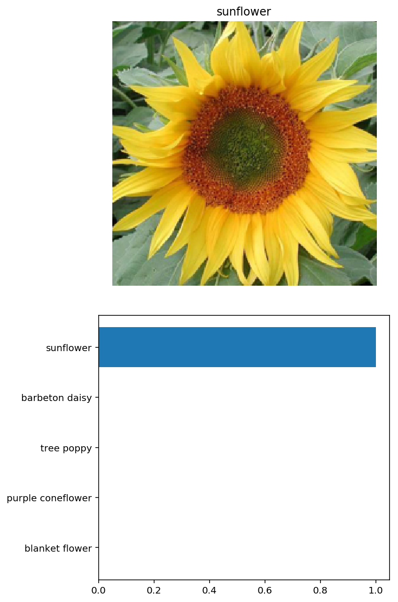

# P2 Image Classifier Application

By Jen-Feng Hsieh

We'll train an image classifier to recognize different species of flowers in this project and be using [this dataset](http://www.robots.ox.ac.uk/~vgg/data/flowers/102/index.html) of 102 flower categories. A few examples is shown below. 


The project is broken down into multiple steps:

* Load and preprocess the image dataset
* Train the image classifier on the dataset
* Use the trained classifier to predict image content


```python
%matplotlib inline
%config InlineBackend.figure_format = 'retina'

# Imports
import matplotlib.pyplot as plt
import numpy as np
import json
from collections import OrderedDict

import torch
from torch import nn
from torch import optim
from torchvision import datasets, transforms, models
```

## Load the data

We'll use `torchvision` to load the data ([documentation](http://pytorch.org/docs/0.3.0/torchvision/index.html)). The dataset is split into three parts, training, validation, and testing. For the training, we apply transformations such as random scaling, cropping, and flipping. This will help the network generalize leading to better performance. We also need to make sure the input data is resized to 224x224 pixels as required by the pre-trained networks.

The validation and testing sets are used to measure the model's performance on data it hasn't seen yet. For this we don't want any scaling or rotation transformations, but we'll need to resize then crop the images to the appropriate size.

The pre-trained networks we use were trained on the ImageNet dataset where each color channel was normalized separately. For all three sets we'll need to normalize the means and standard deviations of the images to what the network expects. For the means, it's `[0.485, 0.456, 0.406]` and for the standard deviations `[0.229, 0.224, 0.225]`, calculated from the ImageNet images.  These values will shift each color channel to be centered at 0 and range from -1 to 1.
 


```python
def load_data(data_dir):
    if len(data_dir) > 0:
        data_dir = data_dir + '/'
        
    train_dir = data_dir + 'train'
    valid_dir = data_dir + 'valid'
    test_dir = data_dir + 'test'

    # Define the transforms for the training, validation, and testing sets
    train_transforms = transforms.Compose([transforms.RandomRotation(30),
                                           transforms.RandomResizedCrop(224),
                                           transforms.RandomHorizontalFlip(),
                                           transforms.ToTensor(),
                                           transforms.Normalize([0.485, 0.456, 0.406], 
                                                                [0.229, 0.224, 0.225])])

    valid_transforms = transforms.Compose([transforms.Resize(256),
                                           transforms.CenterCrop(224),
                                           transforms.ToTensor(),
                                           transforms.Normalize([0.485, 0.456, 0.406], 
                                                                [0.229, 0.224, 0.225])])

    test_transforms = transforms.Compose([transforms.Resize(256),
                                          transforms.CenterCrop(224),
                                          transforms.ToTensor(),
                                          transforms.Normalize([0.485, 0.456, 0.406], 
                                                               [0.229, 0.224, 0.225])])

    # Load the datasets with ImageFolder
    train_data = datasets.ImageFolder(train_dir, transform=train_transforms)
    valid_data = datasets.ImageFolder(valid_dir, transform=valid_transforms)
    test_data = datasets.ImageFolder(test_dir, transform=test_transforms)

    # Using the image datasets and the trainforms, define the dataloaders
    train_loader = torch.utils.data.DataLoader(train_data, batch_size=64, shuffle=True)
    valid_loader = torch.utils.data.DataLoader(valid_data, batch_size=64)
    test_loader = torch.utils.data.DataLoader(test_data, batch_size=64)
    return (train_data, valid_data, test_data, 
            train_loader, valid_loader, test_loader)
```


```python
data_dir = 'flowers'
(train_data, valid_data, test_data, 
 train_loader, valid_loader, test_loader) = load_data(data_dir)
```

### Label mapping

We also need to load in a mapping from category label to category name which is in the file `cat_to_name.json`. It's a JSON object which can be read in with the [`json` module](https://docs.python.org/2/library/json.html). This will give us a dictionary mapping the integer encoded categories to the actual names of the flowers.


```python
with open('cat_to_name.json', 'r') as f:
    cat_to_name = json.load(f)
```

# Building and training the classifier

Now that the data is ready, it's time to build and train the classifier. We will use one of the pretrained models from `torchvision.models` to get the image features. Build and train a new feed-forward classifier using those features.


```python
# Build and train the network
def build_model(arch, hidden_units, output_size, drop_p=0.5):
    pretrained = True

    if arch == 'AlexNet':
        model = models.alexnet(pretrained)
        input_size = 9216
    elif arch == 'VGG':
        model = models.vgg19_bn(pretrained)
        input_size = 25088
    elif arch == 'Densenet':
        model = models.densenet161(pretrained)
        input_size = 2208

    # Freeze parameters so we don't backprop through them
    for param in model.parameters():
        param.requires_grad = False
    
    hidden_units = list(map(int, hidden_units.split(',')))

    layers = OrderedDict([('fc1', nn.Linear(input_size, hidden_units[0])), 
                          ('relu1', nn.ReLU()), 
                          ('drop1', nn.Dropout(p=drop_p))])
    
    if len(hidden_units) > 1:
        layer_sizes = zip(hidden_units[:-1], hidden_units[1:])
        for i, (h1, h2) in enumerate(layer_sizes):
            layers.update({'fc{:d}'.format(i+2): nn.Linear(h1, h2)})
            layers.update({'relu{:d}'.format(i+2): nn.ReLU()})
            layers.update({'drop{:d}'.format(i+2): nn.Dropout(p=drop_p)})
    
    layers.update({'fc{:d}'.format(len(hidden_units) + 1): nn.Linear(hidden_units[-1], 
                                                                     output_size)})
    layers.update({'output': nn.LogSoftmax(dim=1)})
    
    classifier = nn.Sequential(layers)
    model.classifier = classifier
    
    return model


def device_mode(gpu):
    if gpu and torch.cuda.is_available():
        device = 'cuda:0'
    else:
        device = 'cpu'
    return device    


def validation(model, valid_loader, criterion, gpu=False):
    loss = 0
    accuracy = 0
    
    device = device_mode(gpu)
    model.to(device)
    
    # Make sure network is in eval mode for inference
    model.eval()

    # Turn off gradients for validation, saves memory and computations
    with torch.no_grad():
        for inputs, labels in valid_loader:
            inputs, labels = inputs.to(device), labels.to(device)

            outputs = model.forward(inputs)
            loss += criterion(outputs, labels).item()

            ps = torch.exp(outputs)
            equality = (labels.data == ps.max(dim=1)[1])
            accuracy += equality.type(torch.FloatTensor).mean()
    
    return loss, accuracy


def training(model, train_loader, valid_loader, epochs, print_every, criterion, 
             optimizer, gpu=False):
    steps = 0
    running_loss = 0
    accuracy = 0
    
    device = device_mode(gpu)
    model.to(device)
    
    for e in range(epochs):
        # Make sure training is back on
        model.train()
        
        for inputs, labels in train_loader:
            steps += 1
            
            inputs, labels = inputs.to(device), labels.to(device)
            
            # Clear the gradients
            optimizer.zero_grad()
            
            # Forward and backward passes
            outputs = model.forward(inputs)
            loss = criterion(outputs, labels)
            loss.backward()
            optimizer.step()

            running_loss += loss.item()
            
            ps = torch.exp(outputs)
            equality = (labels.data == ps.max(dim=1)[1])
            accuracy += equality.type(torch.FloatTensor).mean() 
            
            if steps % print_every == 0:
                valid_loss, valid_accuracy = validation(model, valid_loader, criterion, gpu)
                
                print("Epoch: {}/{}.. ".format(e + 1, epochs),
                      "Training Loss: {:.3f}.. ".format(running_loss / print_every),
                      "Training Accuracy: {:.3f}.. ".format(accuracy / print_every),
                      "Validation Loss: {:.3f}.. ".format(valid_loss / len(valid_loader)),
                      "Validation Accuracy: {:.3f}".format(valid_accuracy / len(valid_loader)))
                
                running_loss = 0
                accuracy = 0
                
                # Make sure training is back on
                model.train()
    
    return model
```


```python
arch = 'VGG'
hidden_units = '4096'
output_size = 102
learning_rate = 0.001
epochs = 10
print_every = 64
gpu = True

model = build_model(arch, hidden_units, output_size)
criterion = nn.NLLLoss()
optimizer = optim.Adam(model.classifier.parameters(), lr=learning_rate)
```

    Downloading: "https://download.pytorch.org/models/vgg19_bn-c79401a0.pth" to /root/.torch/models/vgg19_bn-c79401a0.pth
    100%|██████████| 574769405/574769405 [00:25<00:00, 22616444.55it/s]


```python
model = training(model, train_loader, valid_loader, epochs, print_every, 
                 criterion, optimizer, gpu)
```

    Epoch: 1/10..  Training Loss: 3.868..  Training Accuracy: 0.252..  Validation Loss: 1.421..  Validation Accuracy: 0.644
    Epoch: 2/10..  Training Loss: 1.695..  Training Accuracy: 0.563..  Validation Loss: 0.762..  Validation Accuracy: 0.794
    Epoch: 2/10..  Training Loss: 1.300..  Training Accuracy: 0.664..  Validation Loss: 0.496..  Validation Accuracy: 0.871
    Epoch: 3/10..  Training Loss: 1.129..  Training Accuracy: 0.689..  Validation Loss: 0.465..  Validation Accuracy: 0.882
    Epoch: 4/10..  Training Loss: 1.019..  Training Accuracy: 0.714..  Validation Loss: 0.453..  Validation Accuracy: 0.870
    Epoch: 4/10..  Training Loss: 0.952..  Training Accuracy: 0.734..  Validation Loss: 0.411..  Validation Accuracy: 0.892
    Epoch: 5/10..  Training Loss: 0.910..  Training Accuracy: 0.748..  Validation Loss: 0.365..  Validation Accuracy: 0.895
    Epoch: 5/10..  Training Loss: 0.925..  Training Accuracy: 0.746..  Validation Loss: 0.335..  Validation Accuracy: 0.904
    Epoch: 6/10..  Training Loss: 0.830..  Training Accuracy: 0.773..  Validation Loss: 0.337..  Validation Accuracy: 0.901
    Epoch: 7/10..  Training Loss: 0.880..  Training Accuracy: 0.760..  Validation Loss: 0.357..  Validation Accuracy: 0.907
    Epoch: 7/10..  Training Loss: 0.882..  Training Accuracy: 0.754..  Validation Loss: 0.361..  Validation Accuracy: 0.898
    Epoch: 8/10..  Training Loss: 0.802..  Training Accuracy: 0.774..  Validation Loss: 0.307..  Validation Accuracy: 0.921
    Epoch: 9/10..  Training Loss: 0.803..  Training Accuracy: 0.774..  Validation Loss: 0.304..  Validation Accuracy: 0.918
    Epoch: 9/10..  Training Loss: 0.782..  Training Accuracy: 0.781..  Validation Loss: 0.342..  Validation Accuracy: 0.914
    Epoch: 10/10..  Training Loss: 0.790..  Training Accuracy: 0.786..  Validation Loss: 0.284..  Validation Accuracy: 0.916
    Epoch: 10/10..  Training Loss: 0.765..  Training Accuracy: 0.790..  Validation Loss: 0.314..  Validation Accuracy: 0.917


## Testing the network

This step will give us a good estimate for the model's performance on completely new images.


```python
# Do validation on the test set
test_loss, accuracy = validation(model, test_loader, criterion, gpu)

print("Testing Loss: {:.3f}.. ".format(test_loss / len(test_loader)),
      "Testing Accuracy: {:.3f}".format(accuracy / len(test_loader)))
```

    Testing Loss: 0.298..  Testing Accuracy: 0.909


## Save the checkpoint

Now that the network is trained, save the model so we can load it later for making predictions.


```python
# Save the mapping of classes to indices 
model.class_to_idx = train_data.class_to_idx

# Move to CPU 
model.cpu()

# Save the checkpoint 
checkpoint = {'arch': arch, 
              'classifier': model.classifier, 
              'class_to_idx': model.class_to_idx, 
              'state_dict': model.state_dict()}
torch.save(checkpoint, 'checkpoint.pth')
```

## Loading the checkpoint

This function is used to load a checkpoint and to rebuild the model.


```python
# Load a checkpoint and rebuild the model
def load_checkpoint(filepath):
    checkpoint = torch.load(filepath)
    
    pretrained = True
    
    arch = checkpoint['arch']
    if arch == 'AlexNet':
        model = models.alexnet(pretrained)
    elif arch == 'VGG':
        model = models.vgg19_bn(pretrained)
    elif arch == 'Densenet':
        model = models.densenet161(pretrained)

    for param in model.parameters():
        param.requires_grad = False
    
    model.classifier = checkpoint['classifier']
    model.class_to_idx = checkpoint['class_to_idx']
    model.load_state_dict(checkpoint['state_dict'])
    
    return model
```


```python
model = load_checkpoint('checkpoint.pth')
```

# Inference for classification

Now we'll write a function to use a trained network for inference. First we need to handle processing the input image such that it can be used in the network. 

## Image Preprocessing

We'll write a function and use `PIL` to load the image ([documentation](https://pillow.readthedocs.io/en/latest/reference/Image.html)). This function will process the images in the same manner used for training. 


```python
def process_image(image_path):
    ''' Scales, crops, and normalizes a PIL image for a PyTorch model,
        returns an Numpy array
    '''
    from PIL import Image
    img = Image.open(image_path)
    
    # Resize the images
    # width > height
    if img.size[0] > img.size[1]:
        # Set the height to 256
        img.thumbnail((10000, 256))
    else:
        # Set the width to 256
        img.thumbnail((256, 10000)) 
    
    # Crop image to 224x224
    left = (img.width - 224) / 2
    bottom = (img.height - 224) / 2
    img = img.crop((left, bottom, left + 224, bottom + 224))
    
    # Normalize
    img = np.array(img) / 255
    mean = np.array([0.485, 0.456, 0.406]) 
    std = np.array([0.229, 0.224, 0.225]) 
    img = (img - mean) / std
    
    # Reorder Dimensions to Color Channels X Width X Height
    img = img.transpose((2, 0, 1))
    
    return img
```

To check the function above, the function below converts a PyTorch tensor and displays the original image in the notebook.


```python
def imshow(image, ax=None, title=None):
    if ax is None:
        fig, ax = plt.subplots()
    
    # PyTorch tensors assume the color channel is the first dimension
    # but matplotlib assumes is the third dimension
    image = image.transpose((1, 2, 0))
    
    # Undo preprocessing
    mean = np.array([0.485, 0.456, 0.406])
    std = np.array([0.229, 0.224, 0.225])
    image = std * image + mean
    
    # Image needs to be clipped between 0 and 1 or it looks like noise when displayed
    image = np.clip(image, 0, 1)
    
    ax.imshow(image)
    ax.set_title(title)
    
    return ax
```

## Class Prediction

We will write a function for making predictions with the model, calculate the class probabilities, and find the $K$ largest values.


```python
def predict(image_path, model, gpu=False, top_n=5):
    ''' Predict the class (or classes) of an image using a trained deep learning model.
    '''  
    image = process_image(image_path)
    # Convert to Tensor 
    image_tensor = torch.from_numpy(image).type(torch.FloatTensor)
    # Add one dimension to image as batch size 1
    image_input = image_tensor.unsqueeze(0)
    
    device = device_mode(gpu)
    image_input = image_input.to(device)
    model.to(device)
    
    # Make sure network is in eval mode for inference
    model.eval()
    # Predict
    output = model.forward(image_input)
    
    # Convert LogSoftmax values to probabilities
    ps = torch.exp(output)
    
    # Returns top n largest elements
    top_ps, top_idx = ps.topk(top_n)
    
    # Convert to Lists
    if gpu == True:
        top_ps = top_ps.cpu()
        top_idx = top_idx.cpu()
    top_ps = top_ps.detach().numpy()[0].tolist() 
    top_idx = top_idx.detach().numpy()[0].tolist() 
    
    # Invert class_to_idx
    idx_to_class = {v: k for k, v in model.class_to_idx.items()}
    
    # Convert indices to classes
    top_classes = [idx_to_class[idx] for idx in top_idx]
    
    return top_ps, top_classes
```

## Sanity Checking

Use a trained model for predictions and check to make sure it makes sense.


```python
def view_classify(image_path, model, gpu, top_n=5):
    # Predict Class
    probs, classes = predict(image_path, model, gpu, top_n)
    
    # Make Plot
    fig, (ax1, ax2) = plt.subplots(figsize=(6,9), nrows=2)
    
    # Get Image Name
    name = cat_to_name[image_path.split('/')[2]]
    # Plot Image
    img = process_image(image_path)
    imshow(img, ax1, title=name)
    ax1.axis('off')
    
    # Plot probabilities
    ax2.barh(np.arange(top_n), probs)
    ax2.set_yticks(np.arange(top_n))
    ax2.set_yticklabels([cat_to_name[c] for c in classes])
    ax2.invert_yaxis()
    plt.tight_layout();
```


```python
image_path = 'flowers/test/54/image_05413.jpg'
gpu = False
top_n = 5
view_classify(image_path, model, gpu, top_n)
```




