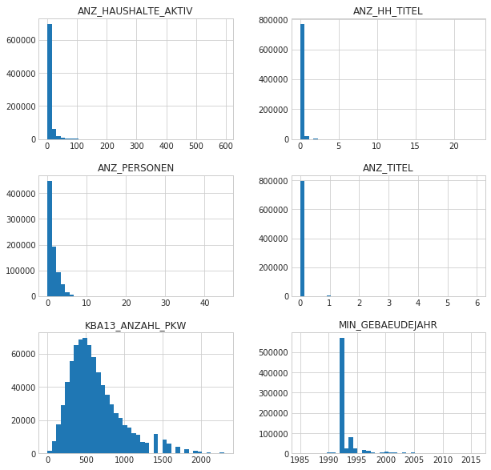

# P3 Identify Customer Segments

By Jen-Feng Hsieh

In this project, I will apply unsupervised learning techniques to identify segments of the population that form the core customer base for a mail-order sales company in Germany. These segments can then be used to direct marketing campaigns towards audiences that will have the highest expected rate of returns.


```python
# Import Libraries
import numpy as np
import pandas as pd
import matplotlib.pyplot as plt
import seaborn as sns

from sklearn.preprocessing import Imputer
from sklearn.preprocessing import StandardScaler
from sklearn.decomposition import PCA
from sklearn.cluster import KMeans

%matplotlib inline
```

## Load the Data

There are three dataset will be used in this project:

- `population.csv`: Demographics data for the general population of Germany; 891211 persons (rows) x 85 features (columns).
- `customers.csv`: Demographics data for customers of a mail-order company; 191652 persons (rows) x 85 features (columns).
- `feature_info.csv`: Summary of feature attributes for demographics data; 85 features (rows) x 4 columns

Each row of the demographics files represents a single person, but also includes information outside of individuals, including information about their household, building, and neighborhood. We will use this information to cluster the general population into groups with similar demographic properties, and see how the people in the customers dataset fit into those created clusters. The hope here is that certain clusters are over-represented in the customers data, as compared to the general population; those over-represented clusters will be assumed to be part of the core userbase. This information can then be used for further applications, such as targeting for a marketing campaign.


```python
# Load in the general demographics data.
population = pd.read_csv('population.csv', sep=';')
df_data = population.copy()

# Load in the feature summary file.
feat_info = pd.read_csv('feature_info.csv', sep=';')
df_feat = feat_info.copy()
```


```python
# Check the structure of the data.
print("Number of rows and columns in Population dataset are ", df_data.shape)
print("Top few records in Population dataset:")
display(df_data.head())
```

    Number of rows and columns in Population dataset are  (891221, 85)
    Top few records in Population dataset:


<div>
<style>
    .dataframe thead tr:only-child th {
        text-align: right;
    }

    .dataframe thead th {
        text-align: left;
    }

    .dataframe tbody tr th {
        vertical-align: top;
    }
</style>
<table border="1" class="dataframe">
  <thead>
    <tr style="text-align: right;">
      <th></th>
      <th>AGER_TYP</th>
      <th>ALTERSKATEGORIE_GROB</th>
      <th>ANREDE_KZ</th>
      <th>CJT_GESAMTTYP</th>
      <th>FINANZ_MINIMALIST</th>
      <th>FINANZ_SPARER</th>
      <th>FINANZ_VORSORGER</th>
      <th>FINANZ_ANLEGER</th>
      <th>FINANZ_UNAUFFAELLIGER</th>
      <th>FINANZ_HAUSBAUER</th>
      <th>...</th>
      <th>PLZ8_ANTG1</th>
      <th>PLZ8_ANTG2</th>
      <th>PLZ8_ANTG3</th>
      <th>PLZ8_ANTG4</th>
      <th>PLZ8_BAUMAX</th>
      <th>PLZ8_HHZ</th>
      <th>PLZ8_GBZ</th>
      <th>ARBEIT</th>
      <th>ORTSGR_KLS9</th>
      <th>RELAT_AB</th>
    </tr>
  </thead>
  <tbody>
    <tr>
      <th>0</th>
      <td>-1</td>
      <td>2</td>
      <td>1</td>
      <td>2.0</td>
      <td>3</td>
      <td>4</td>
      <td>3</td>
      <td>5</td>
      <td>5</td>
      <td>3</td>
      <td>...</td>
      <td>NaN</td>
      <td>NaN</td>
      <td>NaN</td>
      <td>NaN</td>
      <td>NaN</td>
      <td>NaN</td>
      <td>NaN</td>
      <td>NaN</td>
      <td>NaN</td>
      <td>NaN</td>
    </tr>
    <tr>
      <th>1</th>
      <td>-1</td>
      <td>1</td>
      <td>2</td>
      <td>5.0</td>
      <td>1</td>
      <td>5</td>
      <td>2</td>
      <td>5</td>
      <td>4</td>
      <td>5</td>
      <td>...</td>
      <td>2.0</td>
      <td>3.0</td>
      <td>2.0</td>
      <td>1.0</td>
      <td>1.0</td>
      <td>5.0</td>
      <td>4.0</td>
      <td>3.0</td>
      <td>5.0</td>
      <td>4.0</td>
    </tr>
    <tr>
      <th>2</th>
      <td>-1</td>
      <td>3</td>
      <td>2</td>
      <td>3.0</td>
      <td>1</td>
      <td>4</td>
      <td>1</td>
      <td>2</td>
      <td>3</td>
      <td>5</td>
      <td>...</td>
      <td>3.0</td>
      <td>3.0</td>
      <td>1.0</td>
      <td>0.0</td>
      <td>1.0</td>
      <td>4.0</td>
      <td>4.0</td>
      <td>3.0</td>
      <td>5.0</td>
      <td>2.0</td>
    </tr>
    <tr>
      <th>3</th>
      <td>2</td>
      <td>4</td>
      <td>2</td>
      <td>2.0</td>
      <td>4</td>
      <td>2</td>
      <td>5</td>
      <td>2</td>
      <td>1</td>
      <td>2</td>
      <td>...</td>
      <td>2.0</td>
      <td>2.0</td>
      <td>2.0</td>
      <td>0.0</td>
      <td>1.0</td>
      <td>3.0</td>
      <td>4.0</td>
      <td>2.0</td>
      <td>3.0</td>
      <td>3.0</td>
    </tr>
    <tr>
      <th>4</th>
      <td>-1</td>
      <td>3</td>
      <td>1</td>
      <td>5.0</td>
      <td>4</td>
      <td>3</td>
      <td>4</td>
      <td>1</td>
      <td>3</td>
      <td>2</td>
      <td>...</td>
      <td>2.0</td>
      <td>4.0</td>
      <td>2.0</td>
      <td>1.0</td>
      <td>2.0</td>
      <td>3.0</td>
      <td>3.0</td>
      <td>4.0</td>
      <td>6.0</td>
      <td>5.0</td>
    </tr>
  </tbody>
</table>
<p>5 rows × 85 columns</p>
</div>


```python
display(df_data.describe())
```


<div>
<style>
    .dataframe thead tr:only-child th {
        text-align: right;
    }

    .dataframe thead th {
        text-align: left;
    }

    .dataframe tbody tr th {
        vertical-align: top;
    }
</style>
<table border="1" class="dataframe">
  <thead>
    <tr style="text-align: right;">
      <th></th>
      <th>AGER_TYP</th>
      <th>ALTERSKATEGORIE_GROB</th>
      <th>ANREDE_KZ</th>
      <th>CJT_GESAMTTYP</th>
      <th>FINANZ_MINIMALIST</th>
      <th>FINANZ_SPARER</th>
      <th>FINANZ_VORSORGER</th>
      <th>FINANZ_ANLEGER</th>
      <th>FINANZ_UNAUFFAELLIGER</th>
      <th>FINANZ_HAUSBAUER</th>
      <th>...</th>
      <th>PLZ8_ANTG1</th>
      <th>PLZ8_ANTG2</th>
      <th>PLZ8_ANTG3</th>
      <th>PLZ8_ANTG4</th>
      <th>PLZ8_BAUMAX</th>
      <th>PLZ8_HHZ</th>
      <th>PLZ8_GBZ</th>
      <th>ARBEIT</th>
      <th>ORTSGR_KLS9</th>
      <th>RELAT_AB</th>
    </tr>
  </thead>
  <tbody>
    <tr>
      <th>count</th>
      <td>891221.000000</td>
      <td>891221.000000</td>
      <td>891221.000000</td>
      <td>886367.000000</td>
      <td>891221.000000</td>
      <td>891221.000000</td>
      <td>891221.000000</td>
      <td>891221.000000</td>
      <td>891221.000000</td>
      <td>891221.000000</td>
      <td>...</td>
      <td>774706.000000</td>
      <td>774706.000000</td>
      <td>774706.000000</td>
      <td>774706.000000</td>
      <td>774706.000000</td>
      <td>774706.000000</td>
      <td>774706.000000</td>
      <td>794005.000000</td>
      <td>794005.000000</td>
      <td>794005.00000</td>
    </tr>
    <tr>
      <th>mean</th>
      <td>-0.358435</td>
      <td>2.777398</td>
      <td>1.522098</td>
      <td>3.632838</td>
      <td>3.074528</td>
      <td>2.821039</td>
      <td>3.401106</td>
      <td>3.033328</td>
      <td>2.874167</td>
      <td>3.075121</td>
      <td>...</td>
      <td>2.253330</td>
      <td>2.801858</td>
      <td>1.595426</td>
      <td>0.699166</td>
      <td>1.943913</td>
      <td>3.612821</td>
      <td>3.381087</td>
      <td>3.167854</td>
      <td>5.293002</td>
      <td>3.07222</td>
    </tr>
    <tr>
      <th>std</th>
      <td>1.198724</td>
      <td>1.068775</td>
      <td>0.499512</td>
      <td>1.595021</td>
      <td>1.321055</td>
      <td>1.464749</td>
      <td>1.322134</td>
      <td>1.529603</td>
      <td>1.486731</td>
      <td>1.353248</td>
      <td>...</td>
      <td>0.972008</td>
      <td>0.920309</td>
      <td>0.986736</td>
      <td>0.727137</td>
      <td>1.459654</td>
      <td>0.973967</td>
      <td>1.111598</td>
      <td>1.002376</td>
      <td>2.303739</td>
      <td>1.36298</td>
    </tr>
    <tr>
      <th>min</th>
      <td>-1.000000</td>
      <td>1.000000</td>
      <td>1.000000</td>
      <td>1.000000</td>
      <td>1.000000</td>
      <td>1.000000</td>
      <td>1.000000</td>
      <td>1.000000</td>
      <td>1.000000</td>
      <td>1.000000</td>
      <td>...</td>
      <td>0.000000</td>
      <td>0.000000</td>
      <td>0.000000</td>
      <td>0.000000</td>
      <td>1.000000</td>
      <td>1.000000</td>
      <td>1.000000</td>
      <td>1.000000</td>
      <td>0.000000</td>
      <td>1.00000</td>
    </tr>
    <tr>
      <th>25%</th>
      <td>-1.000000</td>
      <td>2.000000</td>
      <td>1.000000</td>
      <td>2.000000</td>
      <td>2.000000</td>
      <td>1.000000</td>
      <td>3.000000</td>
      <td>2.000000</td>
      <td>2.000000</td>
      <td>2.000000</td>
      <td>...</td>
      <td>1.000000</td>
      <td>2.000000</td>
      <td>1.000000</td>
      <td>0.000000</td>
      <td>1.000000</td>
      <td>3.000000</td>
      <td>3.000000</td>
      <td>3.000000</td>
      <td>4.000000</td>
      <td>2.00000</td>
    </tr>
    <tr>
      <th>50%</th>
      <td>-1.000000</td>
      <td>3.000000</td>
      <td>2.000000</td>
      <td>4.000000</td>
      <td>3.000000</td>
      <td>3.000000</td>
      <td>3.000000</td>
      <td>3.000000</td>
      <td>3.000000</td>
      <td>3.000000</td>
      <td>...</td>
      <td>2.000000</td>
      <td>3.000000</td>
      <td>2.000000</td>
      <td>1.000000</td>
      <td>1.000000</td>
      <td>4.000000</td>
      <td>3.000000</td>
      <td>3.000000</td>
      <td>5.000000</td>
      <td>3.00000</td>
    </tr>
    <tr>
      <th>75%</th>
      <td>-1.000000</td>
      <td>4.000000</td>
      <td>2.000000</td>
      <td>5.000000</td>
      <td>4.000000</td>
      <td>4.000000</td>
      <td>5.000000</td>
      <td>5.000000</td>
      <td>4.000000</td>
      <td>4.000000</td>
      <td>...</td>
      <td>3.000000</td>
      <td>3.000000</td>
      <td>2.000000</td>
      <td>1.000000</td>
      <td>3.000000</td>
      <td>4.000000</td>
      <td>4.000000</td>
      <td>4.000000</td>
      <td>7.000000</td>
      <td>4.00000</td>
    </tr>
    <tr>
      <th>max</th>
      <td>3.000000</td>
      <td>9.000000</td>
      <td>2.000000</td>
      <td>6.000000</td>
      <td>5.000000</td>
      <td>5.000000</td>
      <td>5.000000</td>
      <td>5.000000</td>
      <td>5.000000</td>
      <td>5.000000</td>
      <td>...</td>
      <td>4.000000</td>
      <td>4.000000</td>
      <td>3.000000</td>
      <td>2.000000</td>
      <td>5.000000</td>
      <td>5.000000</td>
      <td>5.000000</td>
      <td>9.000000</td>
      <td>9.000000</td>
      <td>9.00000</td>
    </tr>
  </tbody>
</table>
<p>8 rows × 81 columns</p>
</div>


```python
print("Number of rows and columns in Feature Summary dataset are ", df_feat.shape)
print("Top few records in Feature Summary dataset:")
display(df_feat.head())
```

    Number of rows and columns in Feature Summary dataset are  (85, 4)
    Top few records in Feature Summary dataset:


<div>
<style>
    .dataframe thead tr:only-child th {
        text-align: right;
    }

    .dataframe thead th {
        text-align: left;
    }

    .dataframe tbody tr th {
        vertical-align: top;
    }
</style>
<table border="1" class="dataframe">
  <thead>
    <tr style="text-align: right;">
      <th></th>
      <th>attribute</th>
      <th>information_level</th>
      <th>type</th>
      <th>missing_or_unknown</th>
    </tr>
  </thead>
  <tbody>
    <tr>
      <th>0</th>
      <td>AGER_TYP</td>
      <td>person</td>
      <td>categorical</td>
      <td>[-1,0]</td>
    </tr>
    <tr>
      <th>1</th>
      <td>ALTERSKATEGORIE_GROB</td>
      <td>person</td>
      <td>ordinal</td>
      <td>[-1,0,9]</td>
    </tr>
    <tr>
      <th>2</th>
      <td>ANREDE_KZ</td>
      <td>person</td>
      <td>categorical</td>
      <td>[-1,0]</td>
    </tr>
    <tr>
      <th>3</th>
      <td>CJT_GESAMTTYP</td>
      <td>person</td>
      <td>categorical</td>
      <td>[0]</td>
    </tr>
    <tr>
      <th>4</th>
      <td>FINANZ_MINIMALIST</td>
      <td>person</td>
      <td>ordinal</td>
      <td>[-1]</td>
    </tr>
  </tbody>
</table>
</div>


```python
# Reorder columns
df_data = df_data[df_feat['attribute'].tolist()]
```

## Preprocessing

### Assess Missing Data

The feature summary file contains a summary of properties for each demographics data column. We will use this file to make cleaning decisions.

#### Convert Missing Value Codes to NaNs
The fourth column of the feature attributes summary (loaded in above as `feat_info`) documents the codes from the data dictionary that indicate missing or unknown data. While the file encodes this as a list (e.g. `[-1,0]`), this will get read in as a string object. We will do a little bit of parsing to make use of it to identify and clean the data, and convert data that matches a 'missing' or 'unknown' value code into a numpy NaN value.


```python
# Identify missing or unknown data values and convert them to NaNs.

# Convert string to list
df_feat['missing_or_unknown'] = df_feat['missing_or_unknown'].apply(lambda x: x.strip('[]').split(','))
```


```python
def replace_missing(arg, check_list):
    output = arg
    try:
        arg_str = str(float(arg))
    except ValueError:
        arg_str = arg
    
    for ele in check_list:
        try:
            missing_value = str(float(ele))
        except ValueError:
            missing_value = ele
    
        if arg_str == missing_value:
            output = np.nan
            break
    
    return output

for c in df_data.columns.tolist():
    missing_list = df_feat.query("attribute == @c")['missing_or_unknown'].values[0]
    df_data[c] = df_data[c].apply(lambda x: replace_missing(x, missing_list))
```

#### Assess Missing Data in Each Column

There are a few columns that are outliers in terms of the proportion of values that are missing.


```python
# Perform an assessment of how much missing data there is in each column of the dataset.
df_feat['nan_count'] = df_data.isnull().sum().tolist()

ax = sns.distplot(df_feat['nan_count'], bins=40, kde=False)
ax.set(title='Count of Features by Number of Missing Data', 
       xlabel='Count of NaN per Feature', 
       ylabel='Count of Features');
```


```python
# Investigate patterns in the amount of missing data in each column.
sns.set_style("whitegrid")
f, ax = plt.subplots(figsize=(10, 20))
ax = sns.barplot(x="nan_count", y="attribute", 
                 data=df_feat.sort_values(by=['nan_count'], ascending=False))
ax.set(title='Missing Data in each Feature', 
       xlabel='Count of NaN', 
       ylabel='Feature');
```


```python
# Remove the outlier columns from the dataset.
df_feat['nan_ratio'] = df_feat['nan_count'] / len(df_data)

display(df_feat.sort_values(by=['nan_ratio'], ascending=False).head(10))
```


<div>
<style>
    .dataframe thead tr:only-child th {
        text-align: right;
    }

    .dataframe thead th {
        text-align: left;
    }

    .dataframe tbody tr th {
        vertical-align: top;
    }
</style>
<table border="1" class="dataframe">
  <thead>
    <tr style="text-align: right;">
      <th></th>
      <th>attribute</th>
      <th>information_level</th>
      <th>type</th>
      <th>missing_or_unknown</th>
      <th>nan_count</th>
      <th>nan_ratio</th>
    </tr>
  </thead>
  <tbody>
    <tr>
      <th>40</th>
      <td>TITEL_KZ</td>
      <td>person</td>
      <td>categorical</td>
      <td>[-1, 0]</td>
      <td>889061</td>
      <td>0.997576</td>
    </tr>
    <tr>
      <th>0</th>
      <td>AGER_TYP</td>
      <td>person</td>
      <td>categorical</td>
      <td>[-1, 0]</td>
      <td>685843</td>
      <td>0.769554</td>
    </tr>
    <tr>
      <th>47</th>
      <td>KK_KUNDENTYP</td>
      <td>household</td>
      <td>categorical</td>
      <td>[-1]</td>
      <td>584612</td>
      <td>0.655967</td>
    </tr>
    <tr>
      <th>64</th>
      <td>KBA05_BAUMAX</td>
      <td>microcell_rr3</td>
      <td>mixed</td>
      <td>[-1, 0]</td>
      <td>476524</td>
      <td>0.534687</td>
    </tr>
    <tr>
      <th>11</th>
      <td>GEBURTSJAHR</td>
      <td>person</td>
      <td>numeric</td>
      <td>[0]</td>
      <td>392318</td>
      <td>0.440203</td>
    </tr>
    <tr>
      <th>43</th>
      <td>ALTER_HH</td>
      <td>household</td>
      <td>interval</td>
      <td>[0]</td>
      <td>310267</td>
      <td>0.348137</td>
    </tr>
    <tr>
      <th>70</th>
      <td>KKK</td>
      <td>region_rr1</td>
      <td>ordinal</td>
      <td>[-1, 0]</td>
      <td>158064</td>
      <td>0.177357</td>
    </tr>
    <tr>
      <th>73</th>
      <td>REGIOTYP</td>
      <td>region_rr1</td>
      <td>ordinal</td>
      <td>[-1, 0]</td>
      <td>158064</td>
      <td>0.177357</td>
    </tr>
    <tr>
      <th>48</th>
      <td>W_KEIT_KIND_HH</td>
      <td>household</td>
      <td>ordinal</td>
      <td>[-1, 0]</td>
      <td>147988</td>
      <td>0.166051</td>
    </tr>
    <tr>
      <th>60</th>
      <td>KBA05_ANTG1</td>
      <td>microcell_rr3</td>
      <td>ordinal</td>
      <td>[-1]</td>
      <td>133324</td>
      <td>0.149597</td>
    </tr>
  </tbody>
</table>
</div>


```python
ax = sns.distplot(df_feat['nan_ratio'], bins=40, kde=False)
ax.set(title='Count of Features by Ratio of Missing Data', 
       xlabel='Ratio of NaN per Feature', 
       ylabel='Count of Features');
```


```python
threshold_f = 0.3
drop_features = df_feat.query("nan_ratio > @threshold_f")['attribute'].tolist()
print(drop_features, "have missing values more than {:.1f}%.".format(threshold_f * 100))
```

    ['AGER_TYP', 'GEBURTSJAHR', 'TITEL_KZ', 'ALTER_HH', 'KK_KUNDENTYP', 'KBA05_BAUMAX'] have missing values more than 30.0%.


```python
df_data.drop(drop_features, axis=1, inplace=True, errors='ignore')
df_feat = df_feat[~df_feat['attribute'].isin(drop_features)]
```

There are 6 features (AGER_TYP, GEBURTSJAHR, TITEL_KZ, ALTER_HH, KK_KUNDENTYP, KBA05_BAUMAX) having missing values more than 30% which will be removed. The histogram, that counts NaN ratio for each feature, shows most features have missing values less than 15% which is acceptable for us.

#### Assess Missing Data in Each Row

Now, we'll perform a similar assessment for the rows of the dataset.


```python
# Create dataframe to store row information 
rows_info = pd.DataFrame()
rows_info['nan_count'] = df_data.isnull().sum(axis=1).tolist()
rows_info['nan_ratio'] = rows_info['nan_count'] / df_data.shape[1]

ax = sns.distplot(rows_info['nan_ratio'], bins=40, kde=False)
ax.set(title='Count of Rows by Ratio of Missing Data', 
       xlabel='Ratio of NaN per Row', 
       ylabel='Count of Rows');
```


```python
# Divide the data into two subsets based on the number of missing values in each row.
threshold_r = 0.3
df_data_abnormal = df_data[rows_info['nan_ratio'] > threshold_r].copy()
df_data_normal = df_data[rows_info['nan_ratio'] <= threshold_r].copy()

print("There are {:.2f}% rows in dataset having missing values more than {:.1f}%". \
      format(100.0 * len(df_data_abnormal) / len(df_data), 100.0 * threshold_r))
```

    There are 10.48% rows in dataset having missing values more than 30.0%


```python
print("Top few records in the dataset having missing values more than {:.1f}%:".format(100.0 * threshold_r))
display(df_data_abnormal.head())
```

    Top few records in the dataset having missing values more than 30.0%:


<div>
<style>
    .dataframe thead tr:only-child th {
        text-align: right;
    }

    .dataframe thead th {
        text-align: left;
    }

    .dataframe tbody tr th {
        vertical-align: top;
    }
</style>
<table border="1" class="dataframe">
  <thead>
    <tr style="text-align: right;">
      <th></th>
      <th>ALTERSKATEGORIE_GROB</th>
      <th>ANREDE_KZ</th>
      <th>CJT_GESAMTTYP</th>
      <th>FINANZ_MINIMALIST</th>
      <th>FINANZ_SPARER</th>
      <th>FINANZ_VORSORGER</th>
      <th>FINANZ_ANLEGER</th>
      <th>FINANZ_UNAUFFAELLIGER</th>
      <th>FINANZ_HAUSBAUER</th>
      <th>FINANZTYP</th>
      <th>...</th>
      <th>PLZ8_ANTG1</th>
      <th>PLZ8_ANTG2</th>
      <th>PLZ8_ANTG3</th>
      <th>PLZ8_ANTG4</th>
      <th>PLZ8_BAUMAX</th>
      <th>PLZ8_HHZ</th>
      <th>PLZ8_GBZ</th>
      <th>ARBEIT</th>
      <th>ORTSGR_KLS9</th>
      <th>RELAT_AB</th>
    </tr>
  </thead>
  <tbody>
    <tr>
      <th>0</th>
      <td>2.0</td>
      <td>1</td>
      <td>2.0</td>
      <td>3</td>
      <td>4</td>
      <td>3</td>
      <td>5</td>
      <td>5</td>
      <td>3</td>
      <td>4</td>
      <td>...</td>
      <td>NaN</td>
      <td>NaN</td>
      <td>NaN</td>
      <td>NaN</td>
      <td>NaN</td>
      <td>NaN</td>
      <td>NaN</td>
      <td>NaN</td>
      <td>NaN</td>
      <td>NaN</td>
    </tr>
    <tr>
      <th>11</th>
      <td>2.0</td>
      <td>1</td>
      <td>6.0</td>
      <td>3</td>
      <td>4</td>
      <td>3</td>
      <td>5</td>
      <td>5</td>
      <td>3</td>
      <td>4</td>
      <td>...</td>
      <td>NaN</td>
      <td>NaN</td>
      <td>NaN</td>
      <td>NaN</td>
      <td>NaN</td>
      <td>NaN</td>
      <td>NaN</td>
      <td>NaN</td>
      <td>NaN</td>
      <td>NaN</td>
    </tr>
    <tr>
      <th>14</th>
      <td>3.0</td>
      <td>1</td>
      <td>6.0</td>
      <td>3</td>
      <td>4</td>
      <td>3</td>
      <td>5</td>
      <td>5</td>
      <td>3</td>
      <td>4</td>
      <td>...</td>
      <td>NaN</td>
      <td>NaN</td>
      <td>NaN</td>
      <td>NaN</td>
      <td>NaN</td>
      <td>NaN</td>
      <td>NaN</td>
      <td>NaN</td>
      <td>NaN</td>
      <td>NaN</td>
    </tr>
    <tr>
      <th>17</th>
      <td>2.0</td>
      <td>1</td>
      <td>6.0</td>
      <td>3</td>
      <td>4</td>
      <td>3</td>
      <td>5</td>
      <td>5</td>
      <td>3</td>
      <td>4</td>
      <td>...</td>
      <td>NaN</td>
      <td>NaN</td>
      <td>NaN</td>
      <td>NaN</td>
      <td>NaN</td>
      <td>NaN</td>
      <td>NaN</td>
      <td>NaN</td>
      <td>NaN</td>
      <td>NaN</td>
    </tr>
    <tr>
      <th>24</th>
      <td>3.0</td>
      <td>2</td>
      <td>6.0</td>
      <td>3</td>
      <td>4</td>
      <td>3</td>
      <td>5</td>
      <td>5</td>
      <td>3</td>
      <td>4</td>
      <td>...</td>
      <td>NaN</td>
      <td>NaN</td>
      <td>NaN</td>
      <td>NaN</td>
      <td>NaN</td>
      <td>NaN</td>
      <td>NaN</td>
      <td>NaN</td>
      <td>NaN</td>
      <td>NaN</td>
    </tr>
  </tbody>
</table>
<p>5 rows × 79 columns</p>
</div>


```python
print("Top few records in the dataset having missing values less equal to {:.1f}%:".format(100.0 * threshold_r))
display(df_data_normal.head())
```

    Top few records in the dataset having missing values less equal to 30.0%:


<div>
<style>
    .dataframe thead tr:only-child th {
        text-align: right;
    }

    .dataframe thead th {
        text-align: left;
    }

    .dataframe tbody tr th {
        vertical-align: top;
    }
</style>
<table border="1" class="dataframe">
  <thead>
    <tr style="text-align: right;">
      <th></th>
      <th>ALTERSKATEGORIE_GROB</th>
      <th>ANREDE_KZ</th>
      <th>CJT_GESAMTTYP</th>
      <th>FINANZ_MINIMALIST</th>
      <th>FINANZ_SPARER</th>
      <th>FINANZ_VORSORGER</th>
      <th>FINANZ_ANLEGER</th>
      <th>FINANZ_UNAUFFAELLIGER</th>
      <th>FINANZ_HAUSBAUER</th>
      <th>FINANZTYP</th>
      <th>...</th>
      <th>PLZ8_ANTG1</th>
      <th>PLZ8_ANTG2</th>
      <th>PLZ8_ANTG3</th>
      <th>PLZ8_ANTG4</th>
      <th>PLZ8_BAUMAX</th>
      <th>PLZ8_HHZ</th>
      <th>PLZ8_GBZ</th>
      <th>ARBEIT</th>
      <th>ORTSGR_KLS9</th>
      <th>RELAT_AB</th>
    </tr>
  </thead>
  <tbody>
    <tr>
      <th>1</th>
      <td>1.0</td>
      <td>2</td>
      <td>5.0</td>
      <td>1</td>
      <td>5</td>
      <td>2</td>
      <td>5</td>
      <td>4</td>
      <td>5</td>
      <td>1</td>
      <td>...</td>
      <td>2.0</td>
      <td>3.0</td>
      <td>2.0</td>
      <td>1.0</td>
      <td>1.0</td>
      <td>5.0</td>
      <td>4.0</td>
      <td>3.0</td>
      <td>5.0</td>
      <td>4.0</td>
    </tr>
    <tr>
      <th>2</th>
      <td>3.0</td>
      <td>2</td>
      <td>3.0</td>
      <td>1</td>
      <td>4</td>
      <td>1</td>
      <td>2</td>
      <td>3</td>
      <td>5</td>
      <td>1</td>
      <td>...</td>
      <td>3.0</td>
      <td>3.0</td>
      <td>1.0</td>
      <td>0.0</td>
      <td>1.0</td>
      <td>4.0</td>
      <td>4.0</td>
      <td>3.0</td>
      <td>5.0</td>
      <td>2.0</td>
    </tr>
    <tr>
      <th>3</th>
      <td>4.0</td>
      <td>2</td>
      <td>2.0</td>
      <td>4</td>
      <td>2</td>
      <td>5</td>
      <td>2</td>
      <td>1</td>
      <td>2</td>
      <td>6</td>
      <td>...</td>
      <td>2.0</td>
      <td>2.0</td>
      <td>2.0</td>
      <td>0.0</td>
      <td>1.0</td>
      <td>3.0</td>
      <td>4.0</td>
      <td>2.0</td>
      <td>3.0</td>
      <td>3.0</td>
    </tr>
    <tr>
      <th>4</th>
      <td>3.0</td>
      <td>1</td>
      <td>5.0</td>
      <td>4</td>
      <td>3</td>
      <td>4</td>
      <td>1</td>
      <td>3</td>
      <td>2</td>
      <td>5</td>
      <td>...</td>
      <td>2.0</td>
      <td>4.0</td>
      <td>2.0</td>
      <td>1.0</td>
      <td>2.0</td>
      <td>3.0</td>
      <td>3.0</td>
      <td>4.0</td>
      <td>6.0</td>
      <td>5.0</td>
    </tr>
    <tr>
      <th>5</th>
      <td>1.0</td>
      <td>2</td>
      <td>2.0</td>
      <td>3</td>
      <td>1</td>
      <td>5</td>
      <td>2</td>
      <td>2</td>
      <td>5</td>
      <td>2</td>
      <td>...</td>
      <td>2.0</td>
      <td>3.0</td>
      <td>1.0</td>
      <td>1.0</td>
      <td>1.0</td>
      <td>5.0</td>
      <td>5.0</td>
      <td>2.0</td>
      <td>3.0</td>
      <td>3.0</td>
    </tr>
  </tbody>
</table>
<p>5 rows × 79 columns</p>
</div>


```python
# Compare the distribution of values for at least five columns where there are
# no or few missing values, between the two subsets.
def plot_distribution(dataset_normal, dataset_abnormal, feature):
    f, ax1 = plt.subplots(figsize=(15 , 5))
    
    plt.subplot(1,2,1)
    ax1 = sns.countplot(x=feature, data=dataset_normal, color='lightblue')
    ax1.set(title=feature + ' - Count of Categories in Normal Dataset', 
            xlabel='Categories', 
            ylabel='Count')
    plt.subplot(1,2,2)
    ax2 = sns.countplot(x=feature, data=dataset_abnormal, color='lightblue')
    ax2.set(title=feature + ' - Count of Categories in Abnormal Dataset', 
            xlabel='Categories', 
            ylabel='Count');

i = 0
for ele in df_feat[df_feat['type'].isin(['ordinal', 'categorical', 'mixed'])]['attribute'].tolist():
    if df_data_normal[ele].isnull().mean() <= threshold_f and df_data_abnormal[ele].isnull().mean() <= threshold_f:
        plot_distribution(df_data_normal, df_data_abnormal, ele)
        i+=1
    if i >= 5:
        break
```


```python
df_data = df_data_normal.copy()
```

The count plots above show that some of the features in the abnormal dataset have similar distributions with the normal dataset but some of them are not. Let's assume the records in the abnormal dataset can be represented by the data in the normal dataset and ignore it for further analysis. If there is an existing group(cluster) that can be represented by abnormal records in population dataset, then we can verify by comparing it with customer dataset.

### Select and Re-Encode Features

Checking for missing data isn't the only way in which we can prepare a dataset for analysis. Since the unsupervised learning techniques to be used will only work on data that is encoded numerically, we need to make a few encoding changes or additional assumptions to be able to make progress. 

- For numeric and interval data, these features can be kept without changes.
- Most of the variables in the dataset are ordinal in nature. While ordinal values may technically be non-linear in spacing, make the simplifying assumption that the ordinal variables can be treated as being interval in nature (that is, kept without any changes).
- Special handling may be necessary for the remaining two variable types: categorical, and 'mixed'.


```python
print("The summary of feature types is list below.")
df_feat['type'].value_counts()
```

    The summary of feature types is list below.


    ordinal        49
    categorical    18
    numeric         6
    mixed           6
    Name: type, dtype: int64


#### Re-Encode Categorical Features

For categorical data, we would ordinarily need to encode the levels as dummy variables. Depending on the number of categories, perform one of the following:
- For binary (two-level) categoricals that take numeric values, we can keep them without needing to do anything.
- There is one binary variable that takes on non-numeric values. For this one, we need to re-encode the values as numbers or create a dummy variable.
- For multi-level categoricals (three or more values), we can choose to encode the values using multiple dummy variables (e.g. via [OneHotEncoder](http://scikit-learn.org/stable/modules/generated/sklearn.preprocessing.OneHotEncoder.html)), or (to keep things straightforward) just drop them from the analysis.


```python
# Assess categorical variables: which are binary, which are multi-level, and
# which one needs to be re-encoded?

features_categ = pd.DataFrame()
features_categ['attribute'] = df_feat.query("type == 'categorical'")['attribute'].tolist()
features_categ['categories'] = features_categ['attribute'].apply(lambda x: df_data[x].dropna().unique())
features_categ['count'] = features_categ['categories'].apply(lambda x: len(x))

print("Binary variables are ", features_categ.query("count == 2")['attribute'].tolist())
```

    Binary variables are  ['ANREDE_KZ', 'GREEN_AVANTGARDE', 'SOHO_KZ', 'VERS_TYP', 'OST_WEST_KZ']


```python
def categorical_encoder(arg):
    output = {}
    convert = False
    # Check Non-Numeric Values
    for ele in arg:
        try:
            float(ele)
        except ValueError:
            convert = True
            break
    # Create dictionary for encoding
    if convert == True:
        for i, value in enumerate(arg):
            output[value] = i
    # Ignore Multi-Level Variable
    if len(output) > 2:
        output = {}
    return output

features_categ['convert_dict'] = features_categ['categories'].apply(lambda x: categorical_encoder(x))

print("Detail information of Categorical Features:")
display(features_categ)
```

    Detail information of Categorical Features:


<div>
<style>
    .dataframe thead tr:only-child th {
        text-align: right;
    }

    .dataframe thead th {
        text-align: left;
    }

    .dataframe tbody tr th {
        vertical-align: top;
    }
</style>
<table border="1" class="dataframe">
  <thead>
    <tr style="text-align: right;">
      <th></th>
      <th>attribute</th>
      <th>categories</th>
      <th>count</th>
      <th>convert_dict</th>
    </tr>
  </thead>
  <tbody>
    <tr>
      <th>0</th>
      <td>ANREDE_KZ</td>
      <td>[2, 1]</td>
      <td>2</td>
      <td>{}</td>
    </tr>
    <tr>
      <th>1</th>
      <td>CJT_GESAMTTYP</td>
      <td>[5.0, 3.0, 2.0, 4.0, 1.0, 6.0]</td>
      <td>6</td>
      <td>{}</td>
    </tr>
    <tr>
      <th>2</th>
      <td>FINANZTYP</td>
      <td>[1, 6, 5, 2, 4, 3]</td>
      <td>6</td>
      <td>{}</td>
    </tr>
    <tr>
      <th>3</th>
      <td>GFK_URLAUBERTYP</td>
      <td>[10.0, 1.0, 5.0, 12.0, 9.0, 3.0, 8.0, 11.0, 4....</td>
      <td>12</td>
      <td>{}</td>
    </tr>
    <tr>
      <th>4</th>
      <td>GREEN_AVANTGARDE</td>
      <td>[0, 1]</td>
      <td>2</td>
      <td>{}</td>
    </tr>
    <tr>
      <th>5</th>
      <td>LP_FAMILIE_FEIN</td>
      <td>[5.0, 1.0, 10.0, 2.0, 7.0, 11.0, 8.0, 4.0, 6.0...</td>
      <td>11</td>
      <td>{}</td>
    </tr>
    <tr>
      <th>6</th>
      <td>LP_FAMILIE_GROB</td>
      <td>[3.0, 1.0, 5.0, 2.0, 4.0]</td>
      <td>5</td>
      <td>{}</td>
    </tr>
    <tr>
      <th>7</th>
      <td>LP_STATUS_FEIN</td>
      <td>[2.0, 3.0, 9.0, 4.0, 1.0, 10.0, 5.0, 8.0, 6.0,...</td>
      <td>10</td>
      <td>{}</td>
    </tr>
    <tr>
      <th>8</th>
      <td>LP_STATUS_GROB</td>
      <td>[1.0, 2.0, 4.0, 5.0, 3.0]</td>
      <td>5</td>
      <td>{}</td>
    </tr>
    <tr>
      <th>9</th>
      <td>NATIONALITAET_KZ</td>
      <td>[1.0, 3.0, 2.0]</td>
      <td>3</td>
      <td>{}</td>
    </tr>
    <tr>
      <th>10</th>
      <td>SHOPPER_TYP</td>
      <td>[3.0, 2.0, 1.0, 0.0]</td>
      <td>4</td>
      <td>{}</td>
    </tr>
    <tr>
      <th>11</th>
      <td>SOHO_KZ</td>
      <td>[1.0, 0.0]</td>
      <td>2</td>
      <td>{}</td>
    </tr>
    <tr>
      <th>12</th>
      <td>VERS_TYP</td>
      <td>[2.0, 1.0]</td>
      <td>2</td>
      <td>{}</td>
    </tr>
    <tr>
      <th>13</th>
      <td>ZABEOTYP</td>
      <td>[5, 3, 4, 1, 6, 2]</td>
      <td>6</td>
      <td>{}</td>
    </tr>
    <tr>
      <th>14</th>
      <td>GEBAEUDETYP</td>
      <td>[8.0, 1.0, 3.0, 2.0, 6.0, 4.0, 5.0]</td>
      <td>7</td>
      <td>{}</td>
    </tr>
    <tr>
      <th>15</th>
      <td>OST_WEST_KZ</td>
      <td>[W, O]</td>
      <td>2</td>
      <td>{'W': 0, 'O': 1}</td>
    </tr>
    <tr>
      <th>16</th>
      <td>CAMEO_DEUG_2015</td>
      <td>[8, 4, 2, 6, 1, 9, 5, 7, 3]</td>
      <td>9</td>
      <td>{}</td>
    </tr>
    <tr>
      <th>17</th>
      <td>CAMEO_DEU_2015</td>
      <td>[8A, 4C, 2A, 6B, 8C, 4A, 2D, 1A, 1E, 9D, 5C, 8...</td>
      <td>44</td>
      <td>{}</td>
    </tr>
  </tbody>
</table>
</div>


```python
# Encoded Non-Numeric Binary Variables
for ele in features_categ[features_categ['convert_dict'] != {}]['attribute'].tolist():
    df_data[ele] = df_data[ele].map(features_categ.query("attribute == @ele")['convert_dict'].values[0])
```


```python
# Re-encode categorical variable(s) to be kept in the analysis.
def process_integer(arg):
    output = arg
    if arg != 'nan':
        try:
            output = int(float(arg))
        except:
            pass
    return output

for ele in features_categ['attribute'].tolist():
    # Set data type to object for Categorical Variables
    df_data[ele] = df_data[ele].astype(np.str) \
                             .apply(lambda x: process_integer(x)) \
                             .astype(np.object)

# Encode Non-Binary Categorical Variables
encode_features = features_categ.query("count != 2")['attribute'].tolist()
df_data = pd.concat([df_data, pd.get_dummies(df_data[encode_features])], axis=1)

# Drop Original Categorical Variable
df_data.drop(encode_features, axis=1, inplace=True)

# Drop Nan Dummy variable
for ele in encode_features:
    dummy_nan = str(ele + '_nan')
    if dummy_nan in df_data.columns.tolist():
        df_data.drop(dummy_nan, axis=1, inplace=True)
```

OST_WEST_KZ, which is a binary categorical variable having non-numerical values, is converted to the numerical. The non-binary categorical variables in the dataset are processed by the one-hot-ecoding method and the original variables are dropped. There are few missing value columns "XXX_nan" are created during encoding. Those columns will be dropped because the missing value can be represented by zero values in all category type columns.

#### Engineer Mixed-Type Features

There are a handful of features that are marked as "mixed" in the feature summary that require special treatment in order to be included in the analysis. There are two in particular that deserve attention;
- "PRAEGENDE_JUGENDJAHRE" combines information on three dimensions: generation by decade, movement (mainstream vs. avantgarde), and nation (east vs. west). While there aren't enough levels to disentangle east from west, you should create two new variables to capture the other two dimensions: an interval-type variable for decade, and a binary variable for movement.
- "CAMEO_INTL_2015" combines information on two axes: wealth and life stage. Break up the two-digit codes by their 'tens'-place and 'ones'-place digits into two new ordinal variables (which, for the purposes of this project, is equivalent to just treating them as their raw numeric values).


```python
features_mixed = pd.DataFrame()
features_mixed['attribute'] = df_feat.query("type == 'mixed'")['attribute'].tolist()
features_mixed['choosed'] = 'N'
features_mixed['types'] = ''
features_mixed['categories'] = ''

print("Mixed variables are ", features_mixed['attribute'].tolist())
```

    Mixed variables are  ['LP_LEBENSPHASE_FEIN', 'LP_LEBENSPHASE_GROB', 'PRAEGENDE_JUGENDJAHRE', 'WOHNLAGE', 'CAMEO_INTL_2015', 'PLZ8_BAUMAX']


```python
# Investigate "PRAEGENDE_JUGENDJAHRE" and engineer two new variables.
# Investigate "CAMEO_INTL_2015" and engineer two new variables.

# Choose Mixed-Type Feature that will be processed
features_mixed_select = ['PRAEGENDE_JUGENDJAHRE', 'CAMEO_INTL_2015', 'WOHNLAGE']
features_mixed.loc[features_mixed['attribute'].isin(features_mixed_select), 'choosed'] = 'Y'    

# Create lists for new feature names
features_mixed.loc[features_mixed['attribute'] == 'PRAEGENDE_JUGENDJAHRE', 'types'] = \
    [['PRAEGENDE_JUGENDJAHRE_DECADE', 'PRAEGENDE_JUGENDJAHRE_MOVEMENT', 'PRAEGENDE_JUGENDJAHRE_NATION']]
features_mixed.loc[features_mixed['attribute'] == 'CAMEO_INTL_2015', 'types'] = \
    [['CAMEO_INTL_2015_WEALTH', 'CAMEO_INTL_2015_LIFE_STAGE']]    
features_mixed.loc[features_mixed['attribute'] == 'WOHNLAGE', 'types'] = \
    [['WOHNLAGE_NEIGHBOR', 'WOHNLAGE_RURAL']]    

# Create dictionaries for mapping
features_mixed.loc[features_mixed['attribute'] == 'PRAEGENDE_JUGENDJAHRE', 'categories'] = \
    [{'PRAEGENDE_JUGENDJAHRE_DECADE': 
      {1: '40s', 2: '40s', 3: '50s', 4: '50s', 5: '60s', 
       6: '60s', 7: '60s', 8: '70s', 9: '70s', 10: '80s', 
       11: '80s', 12: '80s', 13: '80s', 14: '90s', 15: '90s'}, 
      'PRAEGENDE_JUGENDJAHRE_MOVEMENT': 
      {1: 'Mainstream', 2: 'Avantgarde', 3: 'Mainstream', 4: 'Avantgarde', 5: 'Mainstream', 
       6: 'Avantgarde', 7: 'Avantgarde', 8: 'Mainstream', 9: 'Avantgarde', 10: 'Mainstream', 
       11: 'Avantgarde', 12: 'Mainstream', 13: 'Avantgarde', 14: 'Mainstream', 15: 'Avantgarde'}, 
      'PRAEGENDE_JUGENDJAHRE_NATION': 
      {1: 'E+W', 2: 'E+W', 3: 'E+W', 4: 'E+W', 5: 'E+W', 
       6: 'W', 7: 'E', 8: 'E+W', 9: 'E+W', 10: 'W', 
       11: 'W', 12: 'E', 13: 'E', 14: 'E+W', 15: 'E+W'}
     }]
features_mixed.loc[features_mixed['attribute'] == 'CAMEO_INTL_2015', 'categories'] = \
    [{'CAMEO_INTL_2015_WEALTH': 
      {11: 'Wealthy', 12: 'Wealthy', 13: 'Wealthy', 14: 'Wealthy', 15: 'Wealthy', 
       21: 'Prosperous', 22: 'Prosperous', 23: 'Prosperous', 24: 'Prosperous', 25: 'Prosperous', 
       31: 'Comfortable', 32: 'Comfortable', 33: 'Comfortable', 34: 'Comfortable', 35: 'Comfortable', 
       41: 'Less', 42: 'Less', 43: 'Less', 44: 'Less', 45: 'Less',
       51: 'Poorer', 52: 'Poorer', 53: 'Poorer', 54: 'Poorer', 55: 'Poorer'}, 
      'CAMEO_INTL_2015_LIFE_STAGE': 
      {11: 'Pre-Family', 12: 'Young-Families', 13: 'Families', 14: 'Older', 15: 'Elders', 
       21: 'Pre-Family', 22: 'Young-Families', 23: 'Families', 24: 'Older', 25: 'Elders', 
       31: 'Pre-Family', 32: 'Young-Families', 33: 'Families', 34: 'Older', 35: 'Elders', 
       41: 'Pre-Family', 42: 'Young-Families', 43: 'Families', 44: 'Older', 45: 'Elders', 
       51: 'Pre-Family', 52: 'Young-Families', 53: 'Families', 54: 'Older', 55: 'Elders'}
     }]
features_mixed.loc[features_mixed['attribute'] == 'WOHNLAGE', 'categories'] = \
    [{'WOHNLAGE_NEIGHBOR': 
      {0: 'No-Score', 1: 'Very-Good', 2: 'Good', 3: 'Average', 4: 'Poor', 
       5: 'Very-Poor', 7: 'No-Score', 8: 'No-Score'}, 
      'WOHNLAGE_RURAL': 
      {0: 'Non-Rural', 1: 'Non-Rural', 2: 'Non-Rural', 3: 'Non-Rural', 4: 'Non-Rural', 
       5: 'Non-Rural', 7: 'Rural', 8: 'Rural'},
     }]

print("Detail information for processing Mixed-Type Features:")
display(features_mixed)
```

    Detail information for processing Mixed-Type Features:


<div>
<style>
    .dataframe thead tr:only-child th {
        text-align: right;
    }

    .dataframe thead th {
        text-align: left;
    }

    .dataframe tbody tr th {
        vertical-align: top;
    }
</style>
<table border="1" class="dataframe">
  <thead>
    <tr style="text-align: right;">
      <th></th>
      <th>attribute</th>
      <th>choosed</th>
      <th>types</th>
      <th>categories</th>
    </tr>
  </thead>
  <tbody>
    <tr>
      <th>0</th>
      <td>LP_LEBENSPHASE_FEIN</td>
      <td>N</td>
      <td></td>
      <td></td>
    </tr>
    <tr>
      <th>1</th>
      <td>LP_LEBENSPHASE_GROB</td>
      <td>N</td>
      <td></td>
      <td></td>
    </tr>
    <tr>
      <th>2</th>
      <td>PRAEGENDE_JUGENDJAHRE</td>
      <td>Y</td>
      <td>[PRAEGENDE_JUGENDJAHRE_DECADE, PRAEGENDE_JUGEN...</td>
      <td>{'PRAEGENDE_JUGENDJAHRE_DECADE': {1: '40s', 2:...</td>
    </tr>
    <tr>
      <th>3</th>
      <td>WOHNLAGE</td>
      <td>Y</td>
      <td>[WOHNLAGE_NEIGHBOR, WOHNLAGE_RURAL]</td>
      <td>{'WOHNLAGE_NEIGHBOR': {0: 'No-Score', 1: 'Very...</td>
    </tr>
    <tr>
      <th>4</th>
      <td>CAMEO_INTL_2015</td>
      <td>Y</td>
      <td>[CAMEO_INTL_2015_WEALTH, CAMEO_INTL_2015_LIFE_...</td>
      <td>{'CAMEO_INTL_2015_WEALTH': {11: 'Wealthy', 12:...</td>
    </tr>
    <tr>
      <th>5</th>
      <td>PLZ8_BAUMAX</td>
      <td>N</td>
      <td></td>
      <td></td>
    </tr>
  </tbody>
</table>
</div>


```python
for ele in features_mixed_select:
    # Set data type to object for Categorical Variables
    df_data[ele] = df_data[ele].astype(np.str) \
                             .apply(lambda x: process_integer(x)) \
                             .astype(np.object)
    
    # Get information before processing
    types = features_mixed.query("attribute == @ele and choosed == 'Y'")['types'].values[0]
    categories = features_mixed.query("attribute == @ele and choosed == 'Y'")['categories'].values[0]
    
    # Create features
    for t in types:
        df_data[t] = df_data[ele].map(categories.get(t, {}))
    
    # Drop Original Categorical Variable
    df_data.drop(ele, axis=1, inplace=True) 
    
    # Encode Categorical Variables
    df_data = pd.concat([df_data, pd.get_dummies(df_data[types])], axis=1)
    
    # Drop Variables before encoding
    df_data.drop(types, axis=1, inplace=True) 
    
    # Drop Nan Dummy variable
    for ele in types:
        dummy_nan = str(ele + '_nan')
        if dummy_nan in df_data.columns.tolist():
            df_data.drop(dummy_nan, axis=1, inplace=True)
```


```python
# Drop Non-Selected Mixed-Type Features
drop_features.extend([f for f in features_mixed['attribute'].tolist() if f not in features_mixed_select])
df_data.drop(drop_features, axis=1, inplace=True, errors='ignore')
df_feat = df_feat[~df_feat['attribute'].isin(drop_features)]
```


```python
# Reset Index
df_data.reset_index(drop=True, inplace=True)
```

The list below are the information that each feature represented.
- LP_LEBENSPHASE_FEIN : Life Stage and Fine Scale
- LP_LEBENSPHASE_GROB : Life Stage and Rough Scale
- PRAEGENDE_JUGENDJAHRE : Decade, Movement and Nation 
- WOHNLAGE : Neighborhood quality (or rural flag)
- CAMEO_INTL_2015 : Wealth and Life Stage
- PLZ8_BAUMAX : Building Type Within The PLZ8 Region

LP_LEBENSPHASE_FEIN, LP_LEBENSPHASE_GROB, and PLZ8_BAUMAX features can be represented by other related features, so those features will be dropped. 

PRAEGENDE_JUGENDJAHRE is de-dimension to Decade, Movement and Nation by the definitions. CAMEO_INTL_2015 is de-dimension to Wealth and Life Stage. WOHNLAGE to de-dimension Neighborhood Quality and Rural.

#### Complete Feature Selection

Make sure that the dataframe should consist of the following:
- All numeric, interval, and ordinal type columns from the original dataset.
- Binary categorical features (all numerically-encoded).
- Engineered features from other multi-level categorical features and mixed features.


```python
# Select encoded Categorical and Mixed-Type Features only
encoded_features = [f for f in df_data.columns.tolist() if f not in \
                   df_feat[df_feat['type'].isin(['ordinal', 'numeric', 'interval'])]['attribute'].tolist()]
print("There is {:d} missing value of Encoded Features.".format(df_data[encoded_features].isnull().sum().sum()))
```

    There is 0 missing value of Encoded Features.


### Create a Cleaning Function

Create a cleaning function to perform the same cleaning steps on the customer demographics data.


```python
def clean_data(df_data, df_feat):
    """
    Perform feature trimming, re-encoding, and engineering for demographics
    data
    
    INPUT: 
        Demographics DataFrame, Feature Attributes DataFrame, List of Dropped Features
    OUTPUT: 
        Trimmed and cleaned demographics DataFrame, List of Dropped Features
    """
    
    # Threshold of missing value percentage in each feature that will be removed
    threshold_f = 0.3
    # Threshold of missing value percentage in each row that will be removed
    threshold_r = 0.3
    # Mixed-Type Feature that will be processed
    features_mixed_select = ['PRAEGENDE_JUGENDJAHRE', 'CAMEO_INTL_2015', 'WOHNLAGE']
    
    df_data = df_data.copy()
    df_feat = df_feat.copy()
    
    # Reorder columns
    df_data = df_data[df_feat['attribute'].tolist()]
    
    # ---------- Convert missing or unknown data values to NaNs ---------- 
    # Convert string to list
    df_feat['missing_or_unknown'] = df_feat['missing_or_unknown'].apply(lambda x: x.strip('[]').split(','))
    
    def replace_missing(arg, check_list):
        output = arg
        try:
            arg_str = str(float(arg))
        except ValueError:
            arg_str = arg

        for ele in check_list:
            try:
                missing_value = str(float(ele))
            except ValueError:
                missing_value = ele

            if arg_str == missing_value:
                output = np.nan
                break

        return output

    for c in df_data.columns.tolist():
        missing_list = df_feat.query("attribute == @c")['missing_or_unknown'].values[0]
        df_data[c] = df_data[c].apply(lambda x: replace_missing(x, missing_list))
    
    # ---------- Remove the outlier columns from the dataset ---------- 
    df_feat['nan_count'] = df_data.isnull().sum().tolist()
    df_feat['nan_ratio'] = df_feat['nan_count'] / len(df_data)
    drop_features = df_feat.query("nan_ratio > @threshold_f")['attribute'].tolist()
    df_data.drop(drop_features, axis=1, inplace=True, errors='ignore')
    df_feat = df_feat[~df_feat['attribute'].isin(drop_features)]
    
    # ---------- Remove rows that having too many missing data ---------- 
    # Create dataframe to store row information 
    rows_info = pd.DataFrame()
    rows_info['nan_count'] = df_data.isnull().sum(axis=1).tolist()
    rows_info['nan_ratio'] = rows_info['nan_count'] / df_data.shape[1]
    df_data = df_data[rows_info['nan_ratio'] <= threshold_r].copy()
    
    # ---------- Re-Encode Categorical Features ---------- 
    features_categ = pd.DataFrame()
    features_categ['attribute'] = df_feat.query("type == 'categorical'")['attribute'].tolist()
    features_categ['categories'] = features_categ['attribute'].apply(lambda x: df_data[x].dropna().unique())
    features_categ['count'] = features_categ['categories'].apply(lambda x: len(x))
    
    def categorical_encoder(arg):
        output = {}
        convert = False
        # Check Non-Numeric Values
        for ele in arg:
            try:
                float(ele)
            except ValueError:
                convert = True
                break
        # Create dictionary for encoding
        if convert == True:
            for i, value in enumerate(arg):
                output[value] = i
        # Ignore Multi-Level Variable
        if len(output) > 2:
            output = {}
        return output

    features_categ['convert_dict'] = features_categ['categories'].apply(lambda x: categorical_encoder(x))
    
    # Encoded Non-Numeric Binary Variables
    for ele in features_categ[features_categ['convert_dict'] != {}]['attribute'].tolist():
        df_data[ele] = df_data[ele].map(features_categ.query("attribute == @ele")['convert_dict'].values[0])
    
     # Re-encode categorical variable(s) to be kept in the analysis.
    def process_integer(arg):
        output = arg
        if arg != 'nan':
            try:
                output = int(float(arg))
            except:
                pass
        return output

    for ele in features_categ['attribute'].tolist():
        # Set data type to object for Categorical Variables
        df_data[ele] = df_data[ele].astype(np.str) \
                                 .apply(lambda x: process_integer(x)) \
                                 .astype(np.object)

    # Encode Non-Binary Categorical Variables
    encode_features = features_categ.query("count != 2")['attribute'].tolist()
    df_data = pd.concat([df_data, pd.get_dummies(df_data[encode_features])], axis=1)

    # Drop Original Categorical Variable
    df_data.drop(encode_features, axis=1, inplace=True)

    # Drop Nan Dummy variable
    for ele in encode_features:
        dummy_nan = str(ele + '_nan')
        if dummy_nan in df_data.columns.tolist():
            df_data.drop(dummy_nan, axis=1, inplace=True)   
    
    # ---------- Engineer Mixed-Type Features ---------- 
    features_mixed = pd.DataFrame()
    features_mixed['attribute'] = df_feat.query("type == 'mixed'")['attribute'].tolist()
    features_mixed['choosed'] = 'N'
    features_mixed['types'] = ''
    features_mixed['categories'] = ''
    
    # Drop Mixed-Type Features that are in list of dropped features
    features_mixed_select = [f for f in features_mixed_select if f not in drop_features]
    
    # Choose Mixed-Type Feature that will be processed
    features_mixed.loc[features_mixed['attribute'].isin(features_mixed_select), 'choosed'] = 'Y'
    
    # Create lists for new feature names
    features_mixed.loc[features_mixed['attribute'] == 'PRAEGENDE_JUGENDJAHRE', 'types'] = \
        [['PRAEGENDE_JUGENDJAHRE_DECADE', 'PRAEGENDE_JUGENDJAHRE_MOVEMENT', 'PRAEGENDE_JUGENDJAHRE_NATION']]
    features_mixed.loc[features_mixed['attribute'] == 'CAMEO_INTL_2015', 'types'] = \
        [['CAMEO_INTL_2015_WEALTH', 'CAMEO_INTL_2015_LIFE_STAGE']]    
    features_mixed.loc[features_mixed['attribute'] == 'WOHNLAGE', 'types'] = \
        [['WOHNLAGE_NEIGHBOR', 'WOHNLAGE_RURAL']]    

    # Create dictionaries for mapping
    features_mixed.loc[features_mixed['attribute'] == 'PRAEGENDE_JUGENDJAHRE', 'categories'] = \
        [{'PRAEGENDE_JUGENDJAHRE_DECADE': 
          {1: '40s', 2: '40s', 3: '50s', 4: '50s', 5: '60s', 
           6: '60s', 7: '60s', 8: '70s', 9: '70s', 10: '80s', 
           11: '80s', 12: '80s', 13: '80s', 14: '90s', 15: '90s'}, 
          'PRAEGENDE_JUGENDJAHRE_MOVEMENT': 
          {1: 'Mainstream', 2: 'Avantgarde', 3: 'Mainstream', 4: 'Avantgarde', 5: 'Mainstream', 
           6: 'Avantgarde', 7: 'Avantgarde', 8: 'Mainstream', 9: 'Avantgarde', 10: 'Mainstream', 
           11: 'Avantgarde', 12: 'Mainstream', 13: 'Avantgarde', 14: 'Mainstream', 15: 'Avantgarde'}, 
          'PRAEGENDE_JUGENDJAHRE_NATION': 
          {1: 'E+W', 2: 'E+W', 3: 'E+W', 4: 'E+W', 5: 'E+W', 
           6: 'W', 7: 'E', 8: 'E+W', 9: 'E+W', 10: 'W', 
           11: 'W', 12: 'E', 13: 'E', 14: 'E+W', 15: 'E+W'}
         }]
    features_mixed.loc[features_mixed['attribute'] == 'CAMEO_INTL_2015', 'categories'] = \
        [{'CAMEO_INTL_2015_WEALTH': 
          {11: 'Wealthy', 12: 'Wealthy', 13: 'Wealthy', 14: 'Wealthy', 15: 'Wealthy', 
           21: 'Prosperous', 22: 'Prosperous', 23: 'Prosperous', 24: 'Prosperous', 25: 'Prosperous', 
           31: 'Comfortable', 32: 'Comfortable', 33: 'Comfortable', 34: 'Comfortable', 35: 'Comfortable', 
           41: 'Less', 42: 'Less', 43: 'Less', 44: 'Less', 45: 'Less',
           51: 'Poorer', 52: 'Poorer', 53: 'Poorer', 54: 'Poorer', 55: 'Poorer'}, 
          'CAMEO_INTL_2015_LIFE_STAGE': 
          {11: 'Pre-Family', 12: 'Young-Families', 13: 'Families', 14: 'Older', 15: 'Elders', 
           21: 'Pre-Family', 22: 'Young-Families', 23: 'Families', 24: 'Older', 25: 'Elders', 
           31: 'Pre-Family', 32: 'Young-Families', 33: 'Families', 34: 'Older', 35: 'Elders', 
           41: 'Pre-Family', 42: 'Young-Families', 43: 'Families', 44: 'Older', 45: 'Elders', 
           51: 'Pre-Family', 52: 'Young-Families', 53: 'Families', 54: 'Older', 55: 'Elders'}
         }]
    features_mixed.loc[features_mixed['attribute'] == 'WOHNLAGE', 'categories'] = \
        [{'WOHNLAGE_NEIGHBOR': 
          {0: 'No-Score', 1: 'Very-Good', 2: 'Good', 3: 'Average', 4: 'Poor', 
           5: 'Very-Poor', 7: 'No-Score', 8: 'No-Score'}, 
          'WOHNLAGE_RURAL': 
          {0: 'Non-Rural', 1: 'Non-Rural', 2: 'Non-Rural', 3: 'Non-Rural', 4: 'Non-Rural', 
           5: 'Non-Rural', 7: 'Rural', 8: 'Rural'},
         }]
    
    for ele in features_mixed_select:
        # Set data type to object for Categorical Variables
        df_data[ele] = df_data[ele].astype(np.str) \
                                 .apply(lambda x: process_integer(x)) \
                                 .astype(np.object)

        # Get information before processing
        types = features_mixed.query("attribute == @ele and choosed == 'Y'")['types'].values[0]
        categories = features_mixed.query("attribute == @ele and choosed == 'Y'")['categories'].values[0]

        # Create features
        for t in types:
            df_data[t] = df_data[ele].map(categories.get(t, {}))

        # Drop Original Categorical Variable
        df_data.drop(ele, axis=1, inplace=True) 

        # Encode Categorical Variables
        df_data = pd.concat([df_data, pd.get_dummies(df_data[types])], axis=1)

        # Drop Variables before encoding
        df_data.drop(types, axis=1, inplace=True) 

        # Drop Nan Dummy variable
        for ele in types:
            dummy_nan = str(ele + '_nan')
            if dummy_nan in df_data.columns.tolist():
                df_data.drop(dummy_nan, axis=1, inplace=True)
    
    # Drop Non-Selected Mixed-Type Features
    drop_features.extend([f for f in features_mixed['attribute'].tolist() if f not in features_mixed_select])
    df_data.drop(drop_features, axis=1, inplace=True, errors='ignore')
    df_feat = df_feat[~df_feat['attribute'].isin(drop_features)]
    
    # Reset Index
    df_data.reset_index(drop=True, inplace=True)
    
    return df_data
```

## Feature Transformation

### Apply Feature Scaling

Before we apply dimensionality reduction techniques to the data, we need to perform feature scaling so that the principal component vectors are not influenced by the natural differences in scale for features.


```python
# Cleaned the dataset of all NaN values
ordinal_features = df_feat.query("type == 'ordinal'")['attribute'].tolist()
numeric_features = df_feat.query("type == 'numeric'")['attribute'].tolist()
interval_features = df_feat.query("type == 'interval'")['attribute'].tolist()

nan_count_ordinal = df_data[ordinal_features].isnull().sum().sum()
nan_count_numeric = df_data[numeric_features].isnull().sum().sum()
nan_count_interval = df_data[interval_features].isnull().sum().sum()

print("There is {:d} missing value of Ordinal Features.".format(nan_count_ordinal))
print("There is {:d} missing value of Numeric Features.".format(nan_count_numeric))
print("There is {:d} missing value of Interval Features.".format(nan_count_interval))
```

    There is 630245 missing value of Ordinal Features.
    There is 22697 missing value of Numeric Features.
    There is 0 missing value of Interval Features.


```python
print("Histogram plots of Ordinal Features:")
df_data[ordinal_features].hist(bins=40, figsize=(20, 20));
```

    Histogram plots of Ordinal Features:


```python
print("Histogram plots of Numeric Features:")
df_data[numeric_features].hist(bins=40, figsize=(10, 10));
```

    Histogram plots of Numeric Features:





```python
# Apply feature scaling to the general population demographics data.
def feature_scaling(df):
    df = df.copy().astype(np.float)
    
    features = pd.DataFrame()
    features['attribute'] = df.columns
    features['nan_count'] = df.isnull().sum().tolist()
    features_missing = features.query("nan_count != 0")['attribute'].tolist()
    
    if len(features_missing) > 0:
        # Impute Null Value
        imput = Imputer(missing_values=np.nan, strategy='median', axis=0)
        df[features_missing] = imput.fit_transform(df[features_missing])
    
    # Feature Scaling
    scaler = StandardScaler()
    df = pd.DataFrame(scaler.fit_transform(df))
    df.columns = features['attribute'].tolist()
    
    return df
```


```python
df_data = feature_scaling(df_data)

print("Number of rows and columns in scaled dataset are", df_data.shape)
print("Top few records in the scaled dataset:")
display(df_data.head())
```

    Number of rows and columns in scaled dataset are (797837, 217)
    Top few records in the scaled dataset:


<div>
<style>
    .dataframe thead tr:only-child th {
        text-align: right;
    }

    .dataframe thead th {
        text-align: left;
    }

    .dataframe tbody tr th {
        vertical-align: top;
    }
</style>
<table border="1" class="dataframe">
  <thead>
    <tr style="text-align: right;">
      <th></th>
      <th>ALTERSKATEGORIE_GROB</th>
      <th>ANREDE_KZ</th>
      <th>FINANZ_MINIMALIST</th>
      <th>FINANZ_SPARER</th>
      <th>FINANZ_VORSORGER</th>
      <th>FINANZ_ANLEGER</th>
      <th>FINANZ_UNAUFFAELLIGER</th>
      <th>FINANZ_HAUSBAUER</th>
      <th>GREEN_AVANTGARDE</th>
      <th>HEALTH_TYP</th>
      <th>...</th>
      <th>CAMEO_INTL_2015_LIFE_STAGE_Pre-Family</th>
      <th>CAMEO_INTL_2015_LIFE_STAGE_Young-Families</th>
      <th>WOHNLAGE_NEIGHBOR_Average</th>
      <th>WOHNLAGE_NEIGHBOR_Good</th>
      <th>WOHNLAGE_NEIGHBOR_No-Score</th>
      <th>WOHNLAGE_NEIGHBOR_Poor</th>
      <th>WOHNLAGE_NEIGHBOR_Very-Good</th>
      <th>WOHNLAGE_NEIGHBOR_Very-Poor</th>
      <th>WOHNLAGE_RURAL_Non-Rural</th>
      <th>WOHNLAGE_RURAL_Rural</th>
    </tr>
  </thead>
  <tbody>
    <tr>
      <th>0</th>
      <td>-1.766591</td>
      <td>0.957932</td>
      <td>-1.494575</td>
      <td>1.537983</td>
      <td>-1.040685</td>
      <td>1.466063</td>
      <td>0.958965</td>
      <td>1.339139</td>
      <td>-0.53045</td>
      <td>1.096479</td>
      <td>...</td>
      <td>1.501998</td>
      <td>-0.327505</td>
      <td>-0.674884</td>
      <td>-0.379326</td>
      <td>-0.566060</td>
      <td>2.206453</td>
      <td>-0.241333</td>
      <td>-0.320531</td>
      <td>0.552808</td>
      <td>-0.552808</td>
    </tr>
    <tr>
      <th>1</th>
      <td>0.200523</td>
      <td>0.957932</td>
      <td>-1.494575</td>
      <td>0.864621</td>
      <td>-1.766949</td>
      <td>-0.570955</td>
      <td>0.244386</td>
      <td>1.339139</td>
      <td>1.88519</td>
      <td>1.096479</td>
      <td>...</td>
      <td>-0.665780</td>
      <td>-0.327505</td>
      <td>-0.674884</td>
      <td>2.636253</td>
      <td>-0.566060</td>
      <td>-0.453216</td>
      <td>-0.241333</td>
      <td>-0.320531</td>
      <td>0.552808</td>
      <td>-0.552808</td>
    </tr>
    <tr>
      <th>2</th>
      <td>1.184079</td>
      <td>0.957932</td>
      <td>0.683195</td>
      <td>-0.482102</td>
      <td>1.138107</td>
      <td>-0.570955</td>
      <td>-1.184772</td>
      <td>-0.791524</td>
      <td>-0.53045</td>
      <td>-0.257090</td>
      <td>...</td>
      <td>-0.665780</td>
      <td>3.053388</td>
      <td>-0.674884</td>
      <td>-0.379326</td>
      <td>1.766598</td>
      <td>-0.453216</td>
      <td>-0.241333</td>
      <td>-0.320531</td>
      <td>-1.808947</td>
      <td>1.808947</td>
    </tr>
    <tr>
      <th>3</th>
      <td>0.200523</td>
      <td>-1.043916</td>
      <td>0.683195</td>
      <td>0.191259</td>
      <td>0.411843</td>
      <td>-1.249961</td>
      <td>0.244386</td>
      <td>-0.791524</td>
      <td>-0.53045</td>
      <td>1.096479</td>
      <td>...</td>
      <td>-0.665780</td>
      <td>-0.327505</td>
      <td>1.481736</td>
      <td>-0.379326</td>
      <td>-0.566060</td>
      <td>-0.453216</td>
      <td>-0.241333</td>
      <td>-0.320531</td>
      <td>0.552808</td>
      <td>-0.552808</td>
    </tr>
    <tr>
      <th>4</th>
      <td>-1.766591</td>
      <td>0.957932</td>
      <td>-0.042728</td>
      <td>-1.155464</td>
      <td>1.138107</td>
      <td>-0.570955</td>
      <td>-0.470193</td>
      <td>1.339139</td>
      <td>-0.53045</td>
      <td>1.096479</td>
      <td>...</td>
      <td>-0.665780</td>
      <td>-0.327505</td>
      <td>-0.674884</td>
      <td>-0.379326</td>
      <td>1.766598</td>
      <td>-0.453216</td>
      <td>-0.241333</td>
      <td>-0.320531</td>
      <td>-1.808947</td>
      <td>1.808947</td>
    </tr>
  </tbody>
</table>
<p>5 rows × 217 columns</p>
</div>


There are existing missing values in Ordinal and Numeric Features, so the imputation method is used here to replace missing values by median along each feature. The reason for choosing median as imputation strategy is that there are many features having skew distribution.

After replacing the missing value, the dataset is scaled by Standard Scaler method for further analysis.

### Perform Dimensionality Reduction

We are now ready to apply dimensionality reduction techniques.


```python
# Apply PCA to the data.

# Set Random State 
random_state = 42

pca = PCA(random_state=random_state)
pca.fit(df_data)
```


    PCA(copy=True, iterated_power='auto', n_components=None, random_state=42,
      svd_solver='auto', tol=0.0, whiten=False)


```python
# Investigate the variance accounted for by each principal component.
def scree_plot(pca):
    '''
    Creates a scree plot associated with the principal components 
    
    INPUT: pca - the result of instantian of PCA in scikit learn
            
    OUTPUT:
            None
    '''
    variance_ratio = pca.explained_variance_ratio_
    cumulative_variance_ratio = np.cumsum(variance_ratio)
    num_components = len(variance_ratio)
    index = np.arange(num_components)
    
    f, ax1 = plt.subplots(figsize=(10, 5))
    ax1.bar(index, variance_ratio)
    ax1.set(title='Explained Variance Per Principal Component', 
            xlabel='Principal Component', 
            ylabel='Variance Explained (%)')
    
    ax2 = ax1.twinx()
    
    ax2.plot(index, cumulative_variance_ratio)
    ax2.set(ylabel='Cumulative Variance Explained (%)');
```


```python
scree_plot(pca)
```


```python
# Threshold of PCA Cumulative Variance Explained Percentage
threshold_pca = 0.90
components_count = 0

cumulative_variance_ratio = np.cumsum(pca.explained_variance_ratio_)

for i, value in enumerate(cumulative_variance_ratio):
    if value > threshold_pca:
        components_count = i + 1
        ratio = 100.0 * components_count / df_data.shape[1]
        print("The {:.1f}% of variability in the dataset can be explained by {:d} components".
              format(100.0 * threshold_pca, components_count),  
              "which is {:.1f}% of all features.".
              format(ratio))
        break
```

    The 90.0% of variability in the dataset can be explained by 113 components which is 52.1% of all features.


```python
# Re-apply PCA to the data while selecting for number of components to retain.
pca = PCA(n_components=components_count, random_state=random_state)
pca.fit(df_data)
```


    PCA(copy=True, iterated_power='auto', n_components=113, random_state=42,
      svd_solver='auto', tol=0.0, whiten=False)


The goal is to get the components that can explain 90% of variability in the dataset and PCA model uses 113 components to achieve the result which reduces 47.9% of all features.

### Interpret Principal Components

Now that we have our transformed principal components, it's a nice idea to check out the weight of each variable on the first few components to see if they can be interpreted in some fashion.


```python
# Map weights for the first principal component to corresponding feature names
# and then print the linked values, sorted by weight.
def pca_component_info(df, pca, index):
    crucial_features = []
    
    features = pd.DataFrame()
    features['attribute'] = df.columns
    features['weight'] = pca.components_[index]
    features.sort_values(by=['weight'], ascending=False, inplace=True)
    features.reset_index(drop=True, inplace=True)
    
    crucial_features.extend(features.head()['attribute'].tolist())
    crucial_features.extend(features.tail()['attribute'].tolist())
    
    print("Top 5 positive features of # {:d} principal component.".format(index + 1))
    display(features.head())
    print("")
    print("Top 5 negative features of # {:d} principal component.".format(index + 1))
    display(features.tail())
    
    return crucial_features
    
crucial_features_1_comp = pca_component_info(df_data, pca, 0)
```

    Top 5 positive features of # 1 principal component.


<div>
<style>
    .dataframe thead tr:only-child th {
        text-align: right;
    }

    .dataframe thead th {
        text-align: left;
    }

    .dataframe tbody tr th {
        vertical-align: top;
    }
</style>
<table border="1" class="dataframe">
  <thead>
    <tr style="text-align: right;">
      <th></th>
      <th>attribute</th>
      <th>weight</th>
    </tr>
  </thead>
  <tbody>
    <tr>
      <th>0</th>
      <td>LP_STATUS_GROB_1</td>
      <td>0.188979</td>
    </tr>
    <tr>
      <th>1</th>
      <td>PLZ8_ANTG3</td>
      <td>0.178825</td>
    </tr>
    <tr>
      <th>2</th>
      <td>HH_EINKOMMEN_SCORE</td>
      <td>0.175794</td>
    </tr>
    <tr>
      <th>3</th>
      <td>PLZ8_ANTG4</td>
      <td>0.172252</td>
    </tr>
    <tr>
      <th>4</th>
      <td>ORTSGR_KLS9</td>
      <td>0.161274</td>
    </tr>
  </tbody>
</table>
</div>


    
    Top 5 negative features of # 1 principal component.


<div>
<style>
    .dataframe thead tr:only-child th {
        text-align: right;
    }

    .dataframe thead th {
        text-align: left;
    }

    .dataframe tbody tr th {
        vertical-align: top;
    }
</style>
<table border="1" class="dataframe">
  <thead>
    <tr style="text-align: right;">
      <th></th>
      <th>attribute</th>
      <th>weight</th>
    </tr>
  </thead>
  <tbody>
    <tr>
      <th>212</th>
      <td>KBA05_GBZ</td>
      <td>-0.174382</td>
    </tr>
    <tr>
      <th>213</th>
      <td>FINANZ_MINIMALIST</td>
      <td>-0.175379</td>
    </tr>
    <tr>
      <th>214</th>
      <td>PLZ8_ANTG1</td>
      <td>-0.177626</td>
    </tr>
    <tr>
      <th>215</th>
      <td>KBA05_ANTG1</td>
      <td>-0.180228</td>
    </tr>
    <tr>
      <th>216</th>
      <td>MOBI_REGIO</td>
      <td>-0.197191</td>
    </tr>
  </tbody>
</table>
</div>


```python
# Map weights for the second principal component to corresponding feature names
# and then print the linked values, sorted by weight.
crucial_features_2_comp = pca_component_info(df_data, pca, 1)
```

    Top 5 positive features of # 2 principal component.


<div>
<style>
    .dataframe thead tr:only-child th {
        text-align: right;
    }

    .dataframe thead th {
        text-align: left;
    }

    .dataframe tbody tr th {
        vertical-align: top;
    }
</style>
<table border="1" class="dataframe">
  <thead>
    <tr style="text-align: right;">
      <th></th>
      <th>attribute</th>
      <th>weight</th>
    </tr>
  </thead>
  <tbody>
    <tr>
      <th>0</th>
      <td>ALTERSKATEGORIE_GROB</td>
      <td>0.233684</td>
    </tr>
    <tr>
      <th>1</th>
      <td>FINANZ_VORSORGER</td>
      <td>0.222513</td>
    </tr>
    <tr>
      <th>2</th>
      <td>ZABEOTYP_3</td>
      <td>0.195919</td>
    </tr>
    <tr>
      <th>3</th>
      <td>SEMIO_ERL</td>
      <td>0.176010</td>
    </tr>
    <tr>
      <th>4</th>
      <td>SEMIO_LUST</td>
      <td>0.163801</td>
    </tr>
  </tbody>
</table>
</div>


    
    Top 5 negative features of # 2 principal component.


<div>
<style>
    .dataframe thead tr:only-child th {
        text-align: right;
    }

    .dataframe thead th {
        text-align: left;
    }

    .dataframe tbody tr th {
        vertical-align: top;
    }
</style>
<table border="1" class="dataframe">
  <thead>
    <tr style="text-align: right;">
      <th></th>
      <th>attribute</th>
      <th>weight</th>
    </tr>
  </thead>
  <tbody>
    <tr>
      <th>212</th>
      <td>SEMIO_TRADV</td>
      <td>-0.207714</td>
    </tr>
    <tr>
      <th>213</th>
      <td>FINANZ_ANLEGER</td>
      <td>-0.208603</td>
    </tr>
    <tr>
      <th>214</th>
      <td>SEMIO_REL</td>
      <td>-0.213103</td>
    </tr>
    <tr>
      <th>215</th>
      <td>FINANZ_UNAUFFAELLIGER</td>
      <td>-0.215045</td>
    </tr>
    <tr>
      <th>216</th>
      <td>FINANZ_SPARER</td>
      <td>-0.232394</td>
    </tr>
  </tbody>
</table>
</div>


```python
# Map weights for the third principal component to corresponding feature names
# and then print the linked values, sorted by weight.
crucial_features_3_comp = pca_component_info(df_data, pca, 2)
```

    Top 5 positive features of # 3 principal component.


<div>
<style>
    .dataframe thead tr:only-child th {
        text-align: right;
    }

    .dataframe thead th {
        text-align: left;
    }

    .dataframe tbody tr th {
        vertical-align: top;
    }
</style>
<table border="1" class="dataframe">
  <thead>
    <tr style="text-align: right;">
      <th></th>
      <th>attribute</th>
      <th>weight</th>
    </tr>
  </thead>
  <tbody>
    <tr>
      <th>0</th>
      <td>SEMIO_VERT</td>
      <td>0.229052</td>
    </tr>
    <tr>
      <th>1</th>
      <td>GREEN_AVANTGARDE</td>
      <td>0.214854</td>
    </tr>
    <tr>
      <th>2</th>
      <td>PRAEGENDE_JUGENDJAHRE_MOVEMENT_Avantgarde</td>
      <td>0.214854</td>
    </tr>
    <tr>
      <th>3</th>
      <td>SEMIO_SOZ</td>
      <td>0.192505</td>
    </tr>
    <tr>
      <th>4</th>
      <td>SEMIO_FAM</td>
      <td>0.187666</td>
    </tr>
  </tbody>
</table>
</div>


    
    Top 5 negative features of # 3 principal component.


<div>
<style>
    .dataframe thead tr:only-child th {
        text-align: right;
    }

    .dataframe thead th {
        text-align: left;
    }

    .dataframe tbody tr th {
        vertical-align: top;
    }
</style>
<table border="1" class="dataframe">
  <thead>
    <tr style="text-align: right;">
      <th></th>
      <th>attribute</th>
      <th>weight</th>
    </tr>
  </thead>
  <tbody>
    <tr>
      <th>212</th>
      <td>SEMIO_DOM</td>
      <td>-0.164178</td>
    </tr>
    <tr>
      <th>213</th>
      <td>SEMIO_KRIT</td>
      <td>-0.195792</td>
    </tr>
    <tr>
      <th>214</th>
      <td>PRAEGENDE_JUGENDJAHRE_MOVEMENT_Mainstream</td>
      <td>-0.196192</td>
    </tr>
    <tr>
      <th>215</th>
      <td>SEMIO_KAEM</td>
      <td>-0.201603</td>
    </tr>
    <tr>
      <th>216</th>
      <td>ANREDE_KZ</td>
      <td>-0.239960</td>
    </tr>
  </tbody>
</table>
</div>


**First Component**

Top 5 positive features: 

- LP_STATUS_GROB_1: Social status is low-income earners
- PLZ8_ANTG3: Number of 6-10 family houses in the PLZ8 region
- HH_EINKOMMEN_SCORE: Estimated household net income
- PLZ8_ANTG4: Number of 10+ family houses in the PLZ8 region
- ORTSGR_KLS9: Size of community

Top 5 negative features: 

- MOBI_REGIO: Movement patterns of RR1 region features
- KBA05_ANTG1: Number of 1-2 family houses in the microcell
- PLZ8_ANTG1: Number of 1-2 family houses in the PLZ8 region
- FINANZ_MINIMALIST: Financial typology is low financial interest
- KBA05_GBZ: Number of buildings in the microcell

**Second Component**

Top 5 positive features: 

- ALTERSKATEGORIE_GROB: Estimated age based on given name analysis
- FINANZ_VORSORGER: Financial typology is be prepared
- ZABEOTYP_3: Energy consumption typology is fair supplied.
- SEMIO_ERL: Personality is event-oriented
- SEMIO_LUST: Personality is sensual-minded

Top 5 negative features: 

- FINANZ_SPARER: Financial typology is money-saver
- FINANZ_UNAUFFAELLIGER: Financial typology is inconspicuous
- SEMIO_REL: Personality is religious
- FINANZ_ANLEGER: Financial typology is investor
- SEMIO_TRADV: Personality is tradional-minded

**Third Component**

Top 5 positive features: 

- SEMIO_VERT: Personality is dreamful
- GREEN_AVANTGARDE: Membership in environmental sustainability as part of youth
- PRAEGENDE_JUGENDJAHRE_MOVEMENT_Avantgarde: Dominating movement of person is Avantgarde
- SEMIO_SOZ: Personality is socially-minded
- SEMIO_FAM: Personality is family-minded

Top 5 negative features: 

- ANREDE_KZ: Gender
- SEMIO_KAEM: Personality is combative attitude
- PRAEGENDE_JUGENDJAHRE_MOVEMENT_Mainstream: Dominating movement of person is Mainstream
- SEMIO_KRIT: Personality is critical-minded
- SEMIO_DOM: Personality is dominant-minded

From the detail information above, we can make conclusions as follows: 
The first component gathers the house region and personal financial status. The second component gathers the personal characteristic and the characteristic in finance. The third component gathers the personal characteristic information which is very similar to the second component.

## Clustering

### Apply Clustering to General Population

We've assessed and cleaned the demographics data, then scaled and transformed them. Now, it's time to see how the data clusters in the principal components space. In this step, we will apply k-means clustering to the dataset and use the average within-cluster distances from each point to their assigned cluster's centroid to decide on a number of clusters to keep.


```python
# Transform Data
popu_pca_transf = pca.transform(df_data)

def get_kmeans_score(data, center):
    '''
    returns the kmeans score regarding SSE for points to centers
    INPUT:
        data - the dataset you want to fit kmeans to
        center - the number of centers you want (the k value)
    OUTPUT:
        score - the SSE score for the kmeans model fit to the data
    '''
    # Instantiate and fit the model to the dataset
    kmeans = KMeans(n_clusters=center, random_state=random_state).fit(data)
    # Compute the average within-cluster distances.
    score = np.abs(kmeans.score(data))
    
    return score 

# Over a number of different cluster counts
centers = list(range(1,11))
scores = []

# Run k-means clustering on the data
for center in centers:
    scores.append(get_kmeans_score(popu_pca_transf, center))  
```


```python
# Investigate the change in within-cluster distance across number of clusters.
plt.plot(centers, scores, linestyle='--', marker='o', color='b')
plt.xlabel('K')
plt.ylabel('SSE')
plt.title('SSE vs. K');
```


```python
# Re-fit the k-means model with the selected number of clusters and obtain
# cluster predictions for the general population demographics data.

n_clusters = 5

# Instantiate and fit the model to the dataset
kmeans = KMeans(n_clusters=n_clusters, random_state=random_state).fit(popu_pca_transf)
```

The Sum of Squared Error(SSE) v.s. Number of Clusters figure shows the average within-cluster distances decrease as the number of clusters increase. The best approach for getting an optimal number of clusters is to find elbow area at the curve of the figure which means the slowing improvement of SSE. The clustering method with 5 clusters is the best result from the figure.

### Apply All Steps to the Customer Data

Now that we have clusters and cluster centers for the general population, it's time to see how the customer data maps on to those clusters.


```python
# Load in the customer demographics data.
customers = pd.read_csv('customers.csv', sep=';')
df_cust = customers.copy()
```


```python
# Apply preprocessing, feature transformation, and clustering from the general
# demographics onto the customer data, obtaining cluster predictions for the
# customer demographics data.
df_cust = clean_data(df_cust, feat_info)

# Find missing features
missing_features = list(set(df_data.columns.tolist()) - set(df_cust.columns.tolist()))
print(missing_features, "are the missing features comparing to population dataset.")

# Add missing features to dataframe with 0
for f in missing_features:
    df_cust[f] = 0

# Select
df_cust = df_cust[df_data.columns.tolist()]

df_cust = feature_scaling(df_cust)
```

    ['GEBAEUDETYP_5', 'KKK', 'REGIOTYP'] are the missing features comparing to population dataset.


### Compare Customer Data to Demographics Data

At this point, we have clustered data based on demographics of the general population of Germany, and seen how the customer data for a mail-order sales company maps onto those demographic clusters. In final step, we will compare the two cluster distributions to see where the strongest customer base for the company is.

Consider the proportion of persons in each cluster for the general population, and the proportions for the customers. If we think the company's customer base to be universal, then the cluster assignment proportions should be fairly similar between the two. If there are only particular segments of the population that are interested in the company's products, then we should see a mismatch from one to the other. If there is a higher proportion of persons in a cluster for the customer data compared to the general population (e.g. 5% of persons are assigned to a cluster for the general population, but 15% of the customer data is closest to that cluster's centroid) then that suggests the people in that cluster to be a target audience for the company. On the other hand, the proportion of the data in a cluster being larger in the general population than the customer data (e.g. only 2% of customers closest to a population centroid that captures 6% of the data) suggests that group of persons to be outside of the target demographics.


```python
# Compare the proportion of data in each cluster for the customer data to the
# proportion of data in each cluster for the general population.

# Predict clusters for population dataset
clusters_population = pd.DataFrame()
clusters_population['cluster'] = kmeans.predict(popu_pca_transf)

# Predict clusters for customer dataset
cust_pca_transf = pca.transform(df_cust)
clusters_customer = pd.DataFrame()
clusters_customer['cluster'] = kmeans.predict(cust_pca_transf)
```


```python
cluster_info_population = pd.DataFrame(clusters_population.groupby(['cluster'])['cluster'].count())
cluster_info_population.columns = ['count']
cluster_info_population.reset_index(inplace=True)
cluster_info_population['proportion'] = cluster_info_population['count'].apply(lambda x: x / len(population))
print("Summary of Clusters in Population Dataset:")
display(cluster_info_population)
```

    Summary of Clusters in Population Dataset:


<div>
<style>
    .dataframe thead tr:only-child th {
        text-align: right;
    }

    .dataframe thead th {
        text-align: left;
    }

    .dataframe tbody tr th {
        vertical-align: top;
    }
</style>
<table border="1" class="dataframe">
  <thead>
    <tr style="text-align: right;">
      <th></th>
      <th>cluster</th>
      <th>count</th>
      <th>proportion</th>
    </tr>
  </thead>
  <tbody>
    <tr>
      <th>0</th>
      <td>0</td>
      <td>161779</td>
      <td>0.181525</td>
    </tr>
    <tr>
      <th>1</th>
      <td>1</td>
      <td>166032</td>
      <td>0.186297</td>
    </tr>
    <tr>
      <th>2</th>
      <td>2</td>
      <td>126460</td>
      <td>0.141895</td>
    </tr>
    <tr>
      <th>3</th>
      <td>3</td>
      <td>133572</td>
      <td>0.149875</td>
    </tr>
    <tr>
      <th>4</th>
      <td>4</td>
      <td>209994</td>
      <td>0.235625</td>
    </tr>
  </tbody>
</table>
</div>


```python
cluster_info_customer = pd.DataFrame(clusters_customer.groupby(['cluster'])['cluster'].count())
cluster_info_customer.columns = ['count']
cluster_info_customer.reset_index(inplace=True)
cluster_info_customer['proportion'] = cluster_info_customer['count'].apply(lambda x: x / len(customers))
print("Summary of Clusters in Customer Dataset:")
display(cluster_info_customer)
```

    Summary of Clusters in Customer Dataset:


<div>
<style>
    .dataframe thead tr:only-child th {
        text-align: right;
    }

    .dataframe thead th {
        text-align: left;
    }

    .dataframe tbody tr th {
        vertical-align: top;
    }
</style>
<table border="1" class="dataframe">
  <thead>
    <tr style="text-align: right;">
      <th></th>
      <th>cluster</th>
      <th>count</th>
      <th>proportion</th>
    </tr>
  </thead>
  <tbody>
    <tr>
      <th>0</th>
      <td>0</td>
      <td>31690</td>
      <td>0.165352</td>
    </tr>
    <tr>
      <th>1</th>
      <td>1</td>
      <td>11310</td>
      <td>0.059013</td>
    </tr>
    <tr>
      <th>2</th>
      <td>2</td>
      <td>42632</td>
      <td>0.222445</td>
    </tr>
    <tr>
      <th>3</th>
      <td>3</td>
      <td>18394</td>
      <td>0.095976</td>
    </tr>
    <tr>
      <th>4</th>
      <td>4</td>
      <td>37682</td>
      <td>0.196617</td>
    </tr>
  </tbody>
</table>
</div>


```python
f, ax1 = plt.subplots(figsize=(15 , 5))
plt.subplot(1,2,1)
ax1 = sns.barplot(x='cluster', y='proportion', data=cluster_info_population)
ax1.set(title='Proportion of Clusters in Population Dataset', 
        xlabel='Cluster', 
        ylabel='Proportion')
plt.subplot(1,2,2)
ax2 = sns.barplot(x='cluster', y='proportion', data=cluster_info_customer)
ax2.set(title='Proportion of Clusters in Customer Dataset', 
        xlabel='Cluster', 
        ylabel='Proportion');
```


```python
diff_cust_popu = pd.DataFrame()
diff_cust_popu['difference'] = pd.DataFrame(cluster_info_customer['proportion'] - cluster_info_population['proportion'])
print("Proportion difference between Customer and Population Datasets for each cluster:")
display(diff_cust_popu)
```

    Proportion difference between Customer and Population Datasets for each cluster:


<div>
<style>
    .dataframe thead tr:only-child th {
        text-align: right;
    }

    .dataframe thead th {
        text-align: left;
    }

    .dataframe tbody tr th {
        vertical-align: top;
    }
</style>
<table border="1" class="dataframe">
  <thead>
    <tr style="text-align: right;">
      <th></th>
      <th>difference</th>
    </tr>
  </thead>
  <tbody>
    <tr>
      <th>0</th>
      <td>-0.016173</td>
    </tr>
    <tr>
      <th>1</th>
      <td>-0.127284</td>
    </tr>
    <tr>
      <th>2</th>
      <td>0.080550</td>
    </tr>
    <tr>
      <th>3</th>
      <td>-0.053899</td>
    </tr>
    <tr>
      <th>4</th>
      <td>-0.039008</td>
    </tr>
  </tbody>
</table>
</div>


```python
pct_drop_popu = 100.0 * (len(population) -len(clusters_population)) / len(population)
pct_drop_cust = 100.0 * (len(customers) -len(clusters_customer)) / len(customers)
print("{:.2f}% of records are dropped from population dataset.".format(pct_drop_popu))
print("{:.2f}% of records are dropped from customer dataset.".format(pct_drop_cust))
print("Proportion difference between Customer and Population Datasets for dropped records is {:.4f}". \
      format((pct_drop_cust - pct_drop_popu) / 100))
```

    10.48% of records are dropped from population dataset.
    26.06% of records are dropped from customer dataset.
    Proportion difference between Customer and Population Datasets for dropped records is 0.1558


```python
cluster_over_repre = diff_cust_popu['difference'].idxmax()
print("The cluster {:d} is overrepresented in the customer data compared to the general population.". \
      format(cluster_over_repre))

df_popu_popular = pd.DataFrame(pca.inverse_transform(popu_pca_transf[clusters_population['cluster'] == cluster_over_repre]))
df_popu_popular.columns = df_data.columns
print("Top 10 important features of first component in popular dataset:")
display(df_popu_popular[crucial_features_1_comp].head())
```

    The cluster 2 is overrepresented in the customer data compared to the general population.
    Top 10 important features of first component in popular dataset:


<div>
<style>
    .dataframe thead tr:only-child th {
        text-align: right;
    }

    .dataframe thead th {
        text-align: left;
    }

    .dataframe tbody tr th {
        vertical-align: top;
    }
</style>
<table border="1" class="dataframe">
  <thead>
    <tr style="text-align: right;">
      <th></th>
      <th>LP_STATUS_GROB_1</th>
      <th>PLZ8_ANTG3</th>
      <th>HH_EINKOMMEN_SCORE</th>
      <th>PLZ8_ANTG4</th>
      <th>ORTSGR_KLS9</th>
      <th>KBA05_GBZ</th>
      <th>FINANZ_MINIMALIST</th>
      <th>PLZ8_ANTG1</th>
      <th>KBA05_ANTG1</th>
      <th>MOBI_REGIO</th>
    </tr>
  </thead>
  <tbody>
    <tr>
      <th>0</th>
      <td>-0.432617</td>
      <td>0.129642</td>
      <td>-0.927909</td>
      <td>0.002804</td>
      <td>-0.100438</td>
      <td>0.594834</td>
      <td>0.623269</td>
      <td>-0.176796</td>
      <td>0.701227</td>
      <td>0.533355</td>
    </tr>
    <tr>
      <th>1</th>
      <td>-0.432206</td>
      <td>0.760298</td>
      <td>-1.629327</td>
      <td>0.202956</td>
      <td>0.248460</td>
      <td>0.674355</td>
      <td>1.176399</td>
      <td>-0.666424</td>
      <td>0.308807</td>
      <td>0.415561</td>
    </tr>
    <tr>
      <th>2</th>
      <td>-1.143700</td>
      <td>-0.156032</td>
      <td>-1.194796</td>
      <td>0.138535</td>
      <td>-0.197910</td>
      <td>0.386322</td>
      <td>0.540349</td>
      <td>-0.028488</td>
      <td>0.188528</td>
      <td>0.360981</td>
    </tr>
    <tr>
      <th>3</th>
      <td>-0.651698</td>
      <td>0.312198</td>
      <td>-0.661239</td>
      <td>0.169029</td>
      <td>0.464199</td>
      <td>0.826420</td>
      <td>1.062561</td>
      <td>-0.078658</td>
      <td>1.064272</td>
      <td>0.804801</td>
    </tr>
    <tr>
      <th>4</th>
      <td>-1.440302</td>
      <td>1.082629</td>
      <td>0.011220</td>
      <td>0.901097</td>
      <td>1.402242</td>
      <td>0.322541</td>
      <td>0.533594</td>
      <td>-0.880207</td>
      <td>0.493624</td>
      <td>0.152986</td>
    </tr>
  </tbody>
</table>
</div>


```python
cluster_under_repre = diff_cust_popu['difference'].idxmin()
print("The cluster {:d} is underrepresented in the customer data compared to the general population.". \
      format(cluster_under_repre))

df_popu_unpopular = pd.DataFrame(pca.inverse_transform(popu_pca_transf[clusters_population['cluster'] == cluster_under_repre]))
df_popu_unpopular.columns = df_data.columns
print("Top 10 important features of first component in unpopular dataset:")
display(df_popu_unpopular[crucial_features_1_comp].head())
```

    The cluster 1 is underrepresented in the customer data compared to the general population.
    Top 10 important features of first component in unpopular dataset:


<div>
<style>
    .dataframe thead tr:only-child th {
        text-align: right;
    }

    .dataframe thead th {
        text-align: left;
    }

    .dataframe tbody tr th {
        vertical-align: top;
    }
</style>
<table border="1" class="dataframe">
  <thead>
    <tr style="text-align: right;">
      <th></th>
      <th>LP_STATUS_GROB_1</th>
      <th>PLZ8_ANTG3</th>
      <th>HH_EINKOMMEN_SCORE</th>
      <th>PLZ8_ANTG4</th>
      <th>ORTSGR_KLS9</th>
      <th>KBA05_GBZ</th>
      <th>FINANZ_MINIMALIST</th>
      <th>PLZ8_ANTG1</th>
      <th>KBA05_ANTG1</th>
      <th>MOBI_REGIO</th>
    </tr>
  </thead>
  <tbody>
    <tr>
      <th>0</th>
      <td>1.060710</td>
      <td>0.427889</td>
      <td>0.836257</td>
      <td>0.705688</td>
      <td>-0.273778</td>
      <td>-1.574401</td>
      <td>-1.814995</td>
      <td>-0.327851</td>
      <td>-0.860591</td>
      <td>-1.396126</td>
    </tr>
    <tr>
      <th>1</th>
      <td>-0.363862</td>
      <td>1.432247</td>
      <td>0.150346</td>
      <td>0.563285</td>
      <td>0.945740</td>
      <td>0.268165</td>
      <td>0.502881</td>
      <td>-1.253169</td>
      <td>-0.204251</td>
      <td>-0.162785</td>
    </tr>
    <tr>
      <th>2</th>
      <td>1.199981</td>
      <td>0.650697</td>
      <td>1.134640</td>
      <td>0.361650</td>
      <td>0.405031</td>
      <td>0.178247</td>
      <td>-1.415590</td>
      <td>-0.627413</td>
      <td>-0.201019</td>
      <td>-0.261614</td>
    </tr>
    <tr>
      <th>3</th>
      <td>1.652585</td>
      <td>1.424375</td>
      <td>1.071127</td>
      <td>1.002503</td>
      <td>1.431968</td>
      <td>-1.124804</td>
      <td>-1.536048</td>
      <td>-1.214907</td>
      <td>-1.410384</td>
      <td>-1.384739</td>
    </tr>
    <tr>
      <th>4</th>
      <td>1.264272</td>
      <td>-0.077461</td>
      <td>0.406550</td>
      <td>-0.243871</td>
      <td>0.270424</td>
      <td>0.129972</td>
      <td>-1.791783</td>
      <td>0.261958</td>
      <td>0.047838</td>
      <td>0.045561</td>
    </tr>
  </tbody>
</table>
</div>


```python
def plot_distribution(df_popu, df_unpopu, feature):
    f, ax1 = plt.subplots(figsize=(15 , 2))
    
    plt.subplot(1,2,1)
    ax1 = sns.distplot(df_popu[feature], bins=40, kde=False)
    ax1.set(title=feature + ' - Popular Dataset', 
            xlabel='Value', 
            ylabel='Count')
    plt.subplot(1,2,2)
    ax2 = sns.distplot(df_unpopu[feature], bins=40, kde=False)
    ax2.set(title=feature + ' - Unpopular Dataset', 
            xlabel='Value', 
            ylabel='Count');

for ele in crucial_features_1_comp:
    plot_distribution(df_popu_popular, df_popu_unpopular, ele)
```


### Compare Customer Data to Demographics Data

The proportion difference of clusters between Customer and Population Datasets show the cluster 2 is is overrepresented in the customer data compared to the general population which means this cluster gets target audiences. The cluster 1 is an underrepresented one that is out of the target. The proportion difference of dropped records between two datasets is 0.1558 that means the target audiences having the higher proportion of missing values, and it will be worth to gather more information to analyze what kind of features are important. 

The histogram plots show the top 10 important features of first component in the popular dataset and unpopular dataset. There are existing the opposite patterns between two datasets. We can conclude that the relatively popular people for the mail-order company have the attributes as follows:

- Lower income earners
- Lower share of 6-10 family homes in the PLZ8 region
- Higher of estimated household net income
- Lower number of 10+ family houses in the PLZ8 region
- Size of community is 20,001 to 50,000 inhabitants
- Movement patterns is very low
- Higher number of 1-2 family houses in the microcell
- Higher number of 1-2 family houses in the PLZ8 region
- Lower status of low financial interest
- Higher number of buildings in the microcell
